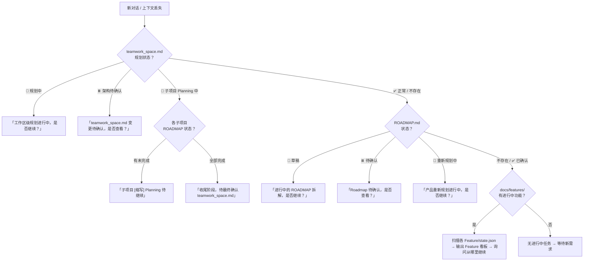

# Teamwork 上下文恢复机制

> 按需加载：仅在新对话恢复 / `/teamwork status` / `/teamwork 继续` 时读取。

---

## 恢复决策树

**新对话或上下文丢失时，按以下决策树（从上到下，命中即停）执行恢复**：



---

## 恢复检查步骤

```
/teamwork status 或 /teamwork 继续
    ↓
0. 🌐 检查 teamwork_space.md 规划状态（Workspace Planning 恢复，最优先）
1. 检查 docs/ROADMAP.md 状态字段（Feature Planning 恢复）
2. 检查 docs/features/ 目录（Feature 流程恢复）
    ↓
输出当前状态看板，询问用户从哪里继续
```

---

## 🌐 Workspace Planning 状态判断（最优先检查）

```
读取 teamwork_space.md「规划状态」字段：

├── 📝 规划中 → 架构讨论阶段，PM 继续与用户讨论整体方向
│   └── PMO 提示：「检测到工作区级规划进行中（架构讨论阶段），是否继续？」
├── ⏸️ 架构待确认 → teamwork_space.md 变更已产出，等待用户确认
│   └── PMO 提示：「检测到 teamwork_space.md 变更待确认，是否查看？」
├── 🔄 子项目 Planning 中 → teamwork_space.md 已确认，正在逐子项目 Planning
│   ├── 遍历受影响子项目列表，检查各子项目 ROADMAP.md 状态
│   ├── 找到未完成的子项目（无 ROADMAP 或状态非 ✅）→ 从该子项目继续
│   ├── 所有子项目已完成 → 进入 Workspace Planning 收尾阶段
│   └── PMO 提示：「工作区级规划中，子项目 [缩写] 的 Planning 待继续」
└── ✅ 正常 / 字段不存在 → 非 Workspace Planning，继续检查子项目级 Planning
```

## Feature Planning 状态判断（优先检查）

```
先检查全景设计状态（design/sitemap.md 是否存在且是否为重建中）：
├── 全景设计正在重建中（PMO 标记）→ 等待 Subagent 完成或用户确认全景
├── 全景已确认但 PROJECT.md 未更新 → PM 继续更新 PROJECT.md
└── 以上均否 → 检查 ROADMAP.md 状态

ROADMAP.md 存在且状态为：
├── 📝 草稿 → Planning 进行中，PM 继续与用户讨论和迭代 ROADMAP
├── ⏸️ 待确认 → PM 已完成分解，等待用户确认 Roadmap
├── 🔄 重新规划中 → 产品方向调整，PM 正在重新讨论
├── ✅ 已确认 → Planning 已完成，可逐个启动 Feature
└── ROADMAP.md 不存在或无状态 → 非 Planning 流程，继续检查 Feature

⚠️ Feature Planning 可能中断在全景设计阶段（ROADMAP 尚未创建）：
├── design/sitemap.md 存在 + ROADMAP.md 不存在 → 可能是全景确认后、ROADMAP 拆解前中断
└── PMO 应询问用户：「全景设计已就绪，是否继续拆解 ROADMAP？」
```

## Feature 流程状态判断

```
检查 docs/features/ 目录，找到进行中的功能
├── PRD.md → 状态: 草稿/待评审/已确认
├── UI.md → 状态: 草稿/待评审/已确认
├── TC.md → 状态: 草稿/待评审/已确认
└── TECH.md → 状态: 设计中/开发中/已完成

PRD 不存在或草稿 → PM 阶段
PRD 已确认，UI 草稿（需要UI）→ Designer 阶段
PRD 已确认，UI 已确认或不需要，TC 草稿 → QA 阶段
TC 已确认，TECH 开发中 → RD 阶段
TECH 已完成 → QA 代码审查阶段
```

---

## Feature 看板输出

**Feature 看板输出**（init 扫描所有 `{Feature}/state.json` 后输出）：
```
📋 Feature 状态看板
| # | Feature | 当前阶段 | 合法下一阶段 | 阻塞状态 | 最后更新 |
|---|---------|----------|--------------|----------|----------|
| ⭐ | AUTH-F001-用户登录 | dev | review | 无 | 2025-03-20 14:30 |
| 2 | WEB-F001-登录页面 | review | test | 无 | 2025-03-20 15:00 |
| 3 | AUTH-F002-权限管理 | - | - | DEP-001@WEB | 2025-03-19 10:00 |

💡 建议优先推进 AUTH-F001（用户登录）
📝 理由：进度最靠前（dev 阶段），无阻塞，推进收益最大。AUTH-F002 等待外部依赖暂时无法推进。

🔴 看板规则（v7.3.2）：
├── 遍历所有 docs/features/*/state.json
├── 排除 current_stage 为 "completed" 的 Feature
├── state.json 不存在但目录有 PRD.md 等文件 → 推断阶段，初始化 state.json
├── 遇到遗留 STATUS.md（v7.2/v7.3 早期）→ 读取一次作为初始化参考，之后忽略
├── ⭐ 标记 PMO 推荐优先推进的 Feature
├── 看板按优先级排序（推荐项在前，其余按 updated_at 降序）
└── 🔴 看板后必须附 💡 建议 + 📝 理由（红线 #10）
```

## Compact 恢复快速路径

> 上下文压缩后的最小恢复路径（优先于完整恢复流程）

```
1. 读取当前 Feature 的 state.json
   → 获得：current_stage / legal_next_stages / stage_contracts / blocking / planned_execution
2. 读取 RULES.md 前 21 行（PMO 热路径索引）
   → 获得：按需定位具体规则的行范围索引
3. 如需详细规则 → 按索引定位读取（非全文）
4. 恢复执行，无需重新走完整决策树

🟢 v7.3.2：state.json 是机读结构化文件，比 markdown 表格更不易被误写，恢复更稳定。
```

---

## 恢复后行为

```
├── 输出 Feature 看板
├── 🔴 PMO 必须分析优先级并给出推荐（红线 #10：禁止只抛状态不给建议）
│   ├── 分析维度：
│   │   ├── 进度最靠前的 Feature（最接近完成，推进收益最大）
│   │   ├── 有阻塞的 Feature（是否阻塞已解除、是否需要用户处理）
│   │   ├── 未跟踪的改动（git status 中未纳入流程管理的文件）
│   │   └── 并行任务的优先级排序（如 CHG 变更 vs Feature 开发）
│   ├── 输出格式：
│   │   💡 建议：优先推进 {Feature 编号}（{功能名}）
│   │   📝 理由：
│   │   ├── {理由 1}
│   │   ├── {理由 2}
│   │   └── {其他 Feature 的简要排期建议}
│   └── 🔴 禁止只列选项让用户自行判断——PMO 必须有明确立场
├── 用户选择要继续的 Feature → 自动进入对应阶段
├── 用户拒绝 → 询问新需求或退出
└── 🔴 恢复时基于 state.json 判断阶段，禁止自行猜测
```
