# Teamwork 文档模板

> 文档按子项目维度组织，每个子项目独立维护 docs/ 目录。

---

## 目录结构

### 多子项目结构（teamwork_space.md 存在时）

```
项目根/
├── teamwork_space.md                      # 🔴 全景入口：架构图 + 子项目链接 + 跨项目追踪
│
├── external/                              # 🔴 三方/外部资源文档（项目根级，一眼识别全部三方依赖）
│   ├── README.md                          # 目录说明 + 三方资源总览索引
│   ├── wechat-pay/                        # 按三方服务/SDK 名称分子目录
│   │   ├── 接入指南.md
│   │   └── API参考.md
│   └── aliyun-oss/
│       └── SDK使用说明.md
│
├── docs/                                  # 全局文档（跨子项目）
│   ├── ROADMAP.md                         # 产品规划 Feature Roadmap（Feature Planning 流程产出）
│   ├── KNOWLEDGE.md                       # 全局知识库（跨子项目经验）
│   ├── RESOURCES.md                       # 全局资源配置（连接串/Key 等，与 external/ 互补）
│   └── decisions/                         # 全局决策记录
│       ├── DEC-001-技术选型.md
│       └── DEC-002-认证方案.md
│
├── auth-service/                          # 子项目 A — business 类型（直接放在项目根下）
│   ├── docs/
│   │   ├── PROJECT.md                     # 子项目总览（从 teamwork_space.md 链接进入）
│   │   ├── features/                      # 子项目级功能目录
│   │   │   └── AUTH-F001-用户登录/        # {子项目缩写}-F{编号}-{功能名}
│   │   │       ├── STATUS.md             # 🔴 Feature 状态标记（当前阶段 + 最后更新）
│   │   │       ├── PRD.md
│   │   │       ├── discuss/              # PL-PM Teams 讨论记录
│   │   │       │   ├── PL-FEEDBACK-R*.md # PL 各轮反馈
│   │   │       │   ├── PM-RESPONSE-R*.md # PM 各轮回应
│   │   │       │   └── PL-PM-DISCUSS.md  # 最终讨论报告
│   │   │       ├── PRD-REVIEW.md
│   │   │       ├── TC.md
│   │   │       ├── TC-REVIEW.md
│   │   │       ├── TECH.md
│   │   │       ├── bugfix/
│   │   │       └── optimization/
│   │   ├── architecture/
│   │   │   ├── ARCHITECTURE.md            # 技术全景索引（Single Source of Truth）
│   │   │   ├── database-schema.md         # 数据库设计（按需创建）
│   │   │   ├── api-design.md              # API 设计（按需创建）
│   │   │   └── deployment.md              # 部署架构（按需创建）
│   │   ├── KNOWLEDGE.md                   # 子项目级知识库
│   │   ├── TEST-DATA.md
│   │   └── integration_test/              # 集成测试前置数据 + compose
│   │       ├── docker-compose.test.yml
│   │       ├── pg/
│   │       │   └── init.sql
│   │       ├── redis/
│   │       │   └── seed.redis
│   │       └── README.md
│   └── src/
│
├── web-app/                               # 子项目 B — business 类型（前端/客户端项目）
│   ├── docs/
│   │   ├── PROJECT.md                     # 子项目总览（从 teamwork_space.md 链接进入）
│   │   ├── design/                        # 🎨 产品全景设计（有 UI 的子项目按需创建）
│   │   │   ├── sitemap.md                 # 页面地图：页面清单 + 导航结构
│   │   │   └── preview/                   # 全景交互原型（产品级 HTML 预览）
│   │   │       ├── overview.html          # 全景入口（缩略卡片 + 跳转）
│   │   │       └── {页面名}.html         # 各核心页面完整交互原型（可互相跳转）
│   │   ├── features/
│   │   │   └── WEB-F001-登录页面/
│   │   │       ├── STATUS.md             # 🔴 Feature 状态标记
│   │   │       ├── PRD.md
│   │   │       ├── discuss/              # PL-PM Teams 讨论记录
│   │   │       │   ├── PL-FEEDBACK-R*.md
│   │   │       │   ├── PM-RESPONSE-R*.md
│   │   │       │   └── PL-PM-DISCUSS.md
│   │   │       ├── UI.md
│   │   │       ├── preview/               # Feature 级 UI 预览（不变）
│   │   │       │   ├── login-page.html
│   │   │       │   └── login-error.html
│   │   │       ├── TC.md
│   │   │       ├── TC-REVIEW.md
│   │   │       ├── TECH.md
│   │   │       ├── bugfix/
│   │   │       └── optimization/
│   │   ├── architecture/
│   │   │   ├── ARCHITECTURE.md            # 技术全景索引
│   │   │   └── ...                        # 子文档按需创建
│   │   └── KNOWLEDGE.md
│   └── src/
│
├── midplatform-payment/                   # 子项目 C — midplatform 类型（中台子项目）
│   ├── docs/
│   │   ├── PROJECT.md                     # 子项目总览（PM 视角：「用户」= 消费方子项目）
│   │   ├── features/
│   │   │   └── PAY-F001-微信支付SDK/
│   │   │       ├── STATUS.md
│   │   │       ├── PRD.md                # 含「消费方分析」增强章节
│   │   │       └── ...                   # 其余文档与 business 子项目完全一致
│   │   ├── architecture/
│   │   │   ├── ARCHITECTURE.md
│   │   │   └── ...
│   │   └── KNOWLEDGE.md
│   └── src/
│
└── ...其他子项目（business 或 midplatform）
```

> 🔴 子项目目录直接放在项目根下，不嵌套 `packages/` 等中间目录。每个子项目是独立的业务线，内部按技术职能分层（`src/controllers/`、`src/services/` 等）。
> 中台子项目（midplatform）在物理目录结构上与业务子项目（business）完全一致，区别仅在 `teamwork_space.md` 的元数据中（类型 + 消费方）。

**功能编号规则**:
- 格式: `{子项目缩写}-F{三位数字}`（如 `AUTH-F001`, `WEB-F001`）
- 编号在各子项目内独立递增（三位数字零补齐，从 001 开始）
- 功能名使用中文或英文均可
- 📎 完整编号规则（含 BUG/OPT/DEC/BG/CHG 格式）见 RULES.md §十二

**通用变更记录表格式**（各模板末尾的「变更记录」基线格式，个别模板可按需扩展列）：
```
## 变更记录
| 日期 | 变更 |
|------|------|
```
> 📎 项目级文档（如 PROJECT.md、KNOWLEDGE.md）可增加「操作人」列；TEST-DATA.md 可增加「功能」列。扩展列在基线列之后追加。

---

## PRD.md

```markdown
# {功能名称}

## 状态
草稿 | 待评审 | 已确认

## 背景

## 用户故事
作为 [角色]，我希望 [功能]，以便 [价值]

## 功能需求

### P0 (必须)
-

### P1 (应该)
-

### P2 (可选)
-

## 业务流程图 / 交互时序图（按需必填）

> 满足以下任一条件时必须画图，不能只用文字描述：
> - 用户操作超过 3 步且有分支路径
> - 涉及 2 个及以上系统/服务交互
> - 有状态流转（如订单状态、审批流）
> - 有异步流程或回调
>
> 不满足以上条件的简单功能可省略本节。
> 📎 图表规范见 standards/common.md「五、文档流程图规范」，统一使用 Mermaid。

### 业务流程（flowchart，多步骤/有分支时必填）
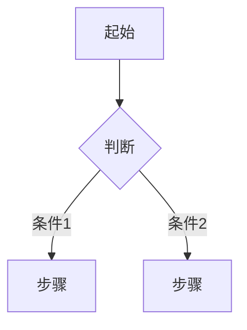

### 系统交互时序（sequenceDiagram，多系统交互时必填）
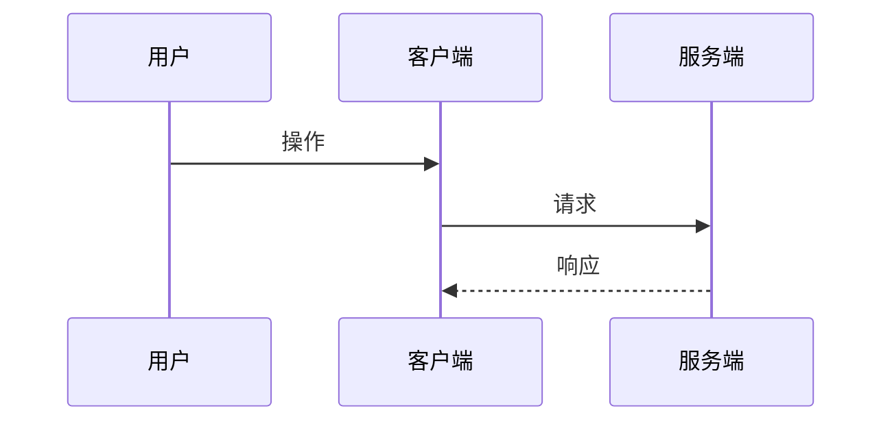

### 状态流转（stateDiagram，有状态机时必填）
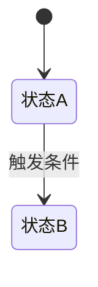

## 验收标准
- [ ]

## 埋点需求（前端/客户端功能必填）
> ⚠️ 纯后端功能可标注「不适用」

| 埋点名称 | 事件类型 | 触发时机 | 参数 | 用途 |
|----------|----------|----------|------|------|
| | PV/Click/Submit/Error | | | |

## 消费方分析（中台子项目必填）

> 🔴 仅 midplatform 类型子项目的 Feature 需要填写此章节。business 类型子项目删除此章节。
> PMO 在 PM 编写 PRD 阶段启动时提示 PM 补充此章节（PRD 初稿即包含，PL-PM 讨论时可完善）。

### 消费方列表
| 消费方子项目 | 需要的能力 | 接入优先级 | 当前状态 |
|-------------|-----------|-----------|----------|
| | | P0/P1/P2 | 待开发/开发中/已接入 |

### API 契约（如适用）
<!-- 中台对外暴露的接口定义，消费方依据此开发 -->

### 兼容性承诺
<!-- 对现有消费方的兼容性保证：是否破坏现有接口、迁移方案等 -->

### 消费方接入计划
<!-- 各消费方何时开始接入、是否需要同步改动 -->

## 待决策项
| ID | 问题 | 选项 | 决策 |
|----|------|------|------|

## 变更记录
| 日期 | 变更 |
|------|------|
```

---

## PRD.md（技术类变体）

> 🔴 适用于纯技术性 Feature（CI/CD、monorepo 配置、共享中间件、监控、部署等）。
> PMO 路由到 INFRA 子项目时默认建议使用此模板；其他子项目的纯技术 Feature 也可选用。
> 与标准 PRD 的区别：跳过用户故事、业务流程图、埋点，增加技术背景和影响范围。

```markdown
# {功能名称}

## 状态
草稿 | 待评审 | 已确认

## 技术背景
<!-- 为什么需要这个技术变更？当前存在什么问题？ -->

## 技术目标
<!-- 这个 Feature 要达成什么技术效果？用可量化的指标描述 -->
<!-- 示例：构建时间从 5min 降到 1min / CI 流水线覆盖所有子项目 / Docker 镜像可构建可部署 -->

## 技术方案要点
<!-- 高层方案概述，替代用户故事。详细方案在 TECH.md 中展开 -->

### 方案概述
-

### 关键技术决策
| 决策点 | 选择 | 理由 |
|--------|------|------|

## 影响范围
<!-- INFRA Feature 天然影响多个子项目，必须明确列出 -->

| 受影响子项目 | 影响方式 | 是否需要配合改动 | 说明 |
|-------------|----------|-----------------|------|
| | 直接/间接 | 是/否 | |

> 🔴 「需要配合改动」= 该子项目需要修改代码或配置才能使用本 Feature 的产出。
> 需要配合改动的子项目应评估是否建立 BG 业务关联。

## 验收标准（技术维度）
- [ ] <!-- 示例：所有子项目可编译通过 -->
- [ ] <!-- 示例：CI 流水线全绿 -->
- [ ] <!-- 示例：Docker 镜像可构建并通过冒烟测试 -->

## 消费方分析（中台子项目必填）

> 📎 内容格式同上方标准 PRD 的「消费方分析」章节（消费方列表 + API 契约 + 兼容性承诺 + 接入计划）。
> 🔴 仅 midplatform 类型子项目的 Feature 需要填写此章节。

## 待决策项
| ID | 问题 | 选项 | 决策 |
|----|------|------|------|

## 变更记录
| 日期 | 变更 |
|------|------|
```

---

## UI.md

```markdown
# {功能名称} - UI 设计

## 状态
草稿 | 待评审 | 已确认

## 预览稿
- [页面1](./preview/page1.html)
- [页面2](./preview/page2.html)

## 用户流程

## 页面结构

### [页面名]

**布局**

**组件**
| 组件 | 类型 | 交互 |
|------|------|------|

**设计标注**
- 主色:
- 字号:
- 间距:

## 响应式
| 断点 | 适配 |
|------|------|

## 状态设计
- 加载态
- 空态
- 错误态

## 变更记录
| 日期 | 变更 |
|------|------|
```

### HTML 预览稿模板

```html
<!-- docs/features/F{编号}-{功能名}/preview/页面名.html -->
<!DOCTYPE html>
<html>
<head>
  <meta charset="UTF-8">
  <meta name="viewport" content="width=device-width, initial-scale=1.0">
  <title>UI-XXX 预览</title>
  <script src="https://cdn.tailwindcss.com"></script>
</head>
<body>
  <!-- 完整的页面预览，包含所有状态 -->
</body>
</html>
```

---

## PRD-REVIEW.md（PRD 评审记录）
```markdown
# {功能名称} - PRD 评审记录

## 当前状态
🔄 第 X 轮评审中 | ✅ 已通过

---

## RD 评审（技术角度）
| ID | 问题 | 类型 | 建议 | 用户确认 | 状态 |
|----|------|------|------|----------|------|
| R1 | | 可行性/复杂度/风险/遗漏 | | 修改/忽略 | 待处理/已处理 |

**工作量预估**: X 人天
**技术风险**: 低/中/高
**RD 结论**: ✅ 可行 / ⚠️ 有风险 / ❌ 不可行

---

## Designer 评审（设计角度）
| ID | 问题 | 类型 | 建议 | 用户确认 | 状态 |
|----|------|------|------|----------|------|
| D1 | | 交互/信息架构/状态/响应式 | | 修改/忽略 | 待处理/已处理 |

**设计工作量**: X 人天
**Designer 结论**: ✅ 可行 / ⚠️ 需补充

---

## QA 评审（测试角度）
| ID | 问题 | 类型 | 建议 | 用户确认 | 状态 |
|----|------|------|------|----------|------|
| Q1 | | 验收标准/边界/异常/可测性 | | 修改/忽略 | 待处理/已处理 |

**QA 结论**: ✅ 清晰 / ⚠️ 需补充

---

## PMO 评审（项目角度）
| ID | 问题 | 类型 | 建议 | 用户确认 | 状态 |
|----|------|------|------|----------|------|
| P1 | | 范围/依赖/时间/优先级/冲突 | | 修改/忽略 | 待处理/已处理 |

**项目风险**: 低/中/高
**PMO 结论**: ✅ 可控 / ⚠️ 有风险

---

## 待用户确认汇总
| 序号 | 来源 | 问题 | 建议方案 | 用户决定 |
|------|------|------|----------|----------|
| 1 | | | | |

---

## 用户确认方式
- 回复「修改 R1」→ PM 按建议修改 PRD
- 回复「忽略 D1」→ 标记为已忽略，记录原因
- 回复「全部接受」→ PM 按所有建议修改
- 回复「通过」→ PRD 进入「已确认」状态

---

## 评审历史

### 第 1 轮 - [日期]
- RD 问题: X 个
- Designer 问题: X 个
- QA 问题: X 个
- PMO 问题: X 个
- 用户确认: 修改 X / 忽略 X
- 结论: 继续修改 / 通过
```

---

## TC.md（BDD/Gherkin 格式）

```markdown
# {功能名称} - 测试用例

## 状态
草稿 | 待评审 | 已确认

---

## Feature: {功能名称}

作为 {角色}
我希望 {功能}
以便 {价值}

---

## 需求覆盖矩阵

| 需求项 | 优先级 | 用例 ID | 状态 |
|--------|--------|---------|------|
| 需求1 | P0 | TC-001, TC-002 | ✅ |
| 需求2 | P1 | TC-003 | ✅ |

覆盖率: X/Y (XX%)

---

## 测试场景

### Scenario: TC-001 {场景描述}
**优先级**: P0 | P1 | P2
**类型**: 功能 | 边界 | 异常

\`\`\`gherkin
Given {前置条件1}
  And {前置条件2，可选}
When {用户操作1}
  And {用户操作2，可选}
Then {预期结果1}
  And {预期结果2，可选}
\`\`\`

**数据库验证**（后端接口需填写）:
| 表名 | 验证项 | 预期值 |
|------|--------|--------|
| users | last_login_at | 更新为当前时间 |

---

### Scenario: TC-002 {场景描述}
**优先级**: P0
**类型**: 功能

\`\`\`gherkin
Given 用户 "test@example.com" 已注册且密码为 "123456"
  And 用户处于登录页面
When 用户输入邮箱 "test@example.com"
  And 用户输入密码 "123456"
  And 用户点击登录按钮
Then 用户应该跳转到首页
  And 用户应该看到欢迎信息 "你好，张三"
\`\`\`

**数据库验证**:
| 表名 | 验证项 | 预期值 |
|------|--------|--------|
| user_sessions | 新记录创建 | session_id 存在 |
| users | last_login_at | 更新 |

---

### Scenario: TC-003 {异常场景}
**优先级**: P0
**类型**: 异常

\`\`\`gherkin
Given 用户 "test@example.com" 已注册
When 用户输入错误密码 "wrong_password"
  And 用户点击登录按钮
Then 用户应该看到错误提示 "密码错误"
  And 用户应该仍在登录页面
  And 登录失败次数应该增加 1
\`\`\`

**API 验证**:
| 接口 | 预期状态码 | 预期 code |
|------|-----------|-----------|
| POST /api/v1/login | 401 | AUTH_FAILED |

---

### Scenario Outline: TC-004 {参数化场景}
**优先级**: P1
**类型**: 边界

\`\`\`gherkin
Given 用户处于注册页面
When 用户输入密码 "<password>"
  And 用户点击注册按钮
Then 用户应该看到 "<result>"

Examples:
| password | result |
| 12345 | 密码至少6位 |
| 123456 | 注册成功 |
| 123456789012345678901 | 密码最多20位 |
\`\`\`

---

## UI 还原检查（如有 UI）

| 检查点 | 设计稿标准 | 状态 |
|--------|------------|------|
| 按钮颜色 | #1890ff | ⬜ |
| 字体大小 | 14px | ⬜ |
| 间距 | 16px | ⬜ |

---

## 实现完整性报告（代码审查时填写）

| 需求项 | 状态 | 代码位置 | 测试位置 |
|--------|------|----------|----------|
| 正常登录 | ✅ | src/auth/login.ts | tests/auth/login.test.ts |
| 密码错误 | ✅ | src/auth/login.ts | tests/auth/login.test.ts |

完整性: X/Y (XX%)

---

## TDD 检查（代码审查时填写）

- [ ] 测试先于实现（检查 git 提交顺序）
- [ ] 后端覆盖率 > 80%
- [ ] 前端覆盖率 > 70%
- [ ] 测试可独立运行
- [ ] 测试命名符合 Scenario 描述
- [ ] 边界条件已覆盖
- [ ] 异常场景已覆盖

---

## 变更记录

| 日期 | 变更 |
|------|------|
```

### Gherkin 语法速查

```
关键字说明：
├── Feature     - 功能描述（一个 TC 文件一个 Feature）
├── Scenario    - 具体测试场景
├── Given       - 前置条件（系统初始状态）
├── When        - 用户操作（触发行为）
├── Then        - 预期结果（断言）
├── And         - 连接多个 Given/When/Then
├── But         - 否定条件
└── Scenario Outline + Examples - 参数化测试

书写原则：
├── 用业务语言，不写技术实现
├── 一个 Scenario 只测一件事
├── Given 描述「是什么状态」，不是「怎么到达」
├── When 描述「做什么」，不是「怎么做」
├── Then 描述「应该怎样」，可观测可验证
└── 避免 UI 细节（如「点击第3个按钮」）
```

---

## TC-REVIEW.md

```markdown
# {功能名称} - 测试用例评审记录

## 当前状态
🔄 第 X 轮评审中 | ✅ 已通过

## PM 评审（需求角度）
| ID | 用例 | 问题 | 类型 | 用户确认 | 状态 |
|----|------|------|------|----------|------|
|    |      |      | 遗漏/不清晰/错误 | 修改/忽略 | 待处理/已修改 |

PM 结论: ✅ 通过 / ❌ 有问题

## RD 评审（技术角度）
| ID | 用例 | 问题 | 类型 | 用户确认 | 状态 |
|----|------|------|------|----------|------|
|    |      |      | 不可行/遗漏/建议 | 修改/忽略 | 待处理/已修改 |

RD 结论: ✅ 通过 / ❌ 有问题

## Designer 评审（UI 角度，如需 UI）
| ID | 用例 | 问题 | 类型 | 用户确认 | 状态 |
|----|------|------|------|----------|------|
|    |      |      | 状态遗漏/交互缺失/视觉验证 | 修改/忽略 | 待处理/已修改 |

Designer 评审维度：
├── 状态覆盖：加载态/空态/错误态是否有用例？
├── 交互验证：关键交互流程是否有用例？
├── 视觉验证：UI 还原检查点是否完整？
└── 特殊状态：设计稿中的特殊状态是否覆盖？

Designer 结论: ✅ 通过 / ❌ 有问题 / ➖ 不需要（非 UI 功能）

## 待用户确认
以上问题需要您确认：
- 回复「修改」+ 问题 ID → QA 将修改用例
- 回复「忽略」+ 问题 ID → 标记为已忽略
- 回复「全部修改」→ 修改所有问题
- 回复「讨论」+ 问题 ID → 记录到决策文档

## 评审历史

### 第 1 轮 - [日期]
- PM 问题: X 个
- RD 问题: X 个
- Designer 问题: X 个（如需 UI）
- 用户确认: 修改 X / 忽略 X
- 结论: 继续修改
```

---

## TECH.md

```markdown
# {功能名称} - 技术方案

## 状态
草稿 | 待评审 | 已确认 | 开发中 | 已完成

## 复杂度评估
- [ ] 修改文件数: X 个
- [ ] 涉及多模块: 是/否
- [ ] 数据库变更: 是/否
- [ ] 影响现有功能: 是/否
- [ ] 新技术栈/依赖: 是/否

**结论**: 复杂方案（需确认）/ 简单方案（可申请跳过，需用户同意）

## 技术方案

### 架构

### 数据结构

### 接口
| 接口 | 方法 | 路径 | 参数 | 返回 |
|------|------|------|------|------|

## 实现思路

> 概述后的思路展开：大致描述如何实现，涉及哪些文件改动，以及关键流程/时序。

### 改动文件清单

> 结合当前项目工程结构 tree 列出，每个文件用 `# 一句话描述` 标注要做的内容。

```
src/
├── api/
│   └── xxx.ts              # 新增/修改 xxx 接口
├── services/
│   └── xxx.ts              # 新增/修改 xxx 业务逻辑
├── models/
│   └── xxx.ts              # 新增/修改 xxx 数据模型
└── components/
    └── xxx.tsx             # 新增/修改 xxx 组件
```

### 数据库变更（涉及 schema 变更时必填，无变更跳过）

> TECH.md 声明涉及 schema 变更时必填。无 schema 变更则删除本节并在「复杂度评估」中注明「无 schema 变更」。

#### 变更表清单

| 表名 | 变更类型 | 变更内容 | 破坏性 |
|------|---------|---------|--------|
| | 新增表/新增列/修改列/删列/新增索引 | | 是/否 |

#### Schema 影响分析（🔴 核心，必须逐表填写）

> 查阅 database-schema.md「Model/Struct 映射」表 + grep 确认，列出所有引用变更表的 Model 和 SQL。

| 受影响 Model/Struct | 所在子项目 | 文件路径 | 需要的同步改动 |
|-------------------|-----------|---------|--------------|
| | | | 加字段 / 改类型 / 更新 SQL 列列表 |

> 📎 **此表是后续 RD 开发、Code Review、集成测试的校验基准**。遗漏 = 线上事故。
> 填写时必须 grep 所有子项目，不能仅凭记忆。database-schema.md 的映射表可能不全，以 grep 结果为准并反向更新 database-schema.md。

#### 迁移策略

- **up**：
- **down（回滚）**：
- **数据迁移**（如需 backfill）：

> 📎 TECH.md 状态含「开发中/已完成」是因为技术方案需跟踪到开发阶段；PRD 状态「草稿/评审中/已确认」在确认后不再变更，因此无需「开发中/已完成」。
- **破坏性变更风险评估**（删列/改类型时必填）：

### 前端技术方案（含 UI 时必填，无 UI 跳过）

> PRD 标注「需要 UI: 是」时必填。

- **组件结构**: 新增/修改的组件树及层级关系
- **状态管理**: 状态存储方案（local state / context / store）、数据流方向
- **路由变更**: 新增/修改的路由及守卫逻辑
- **样式方案**: CSS 方案（Tailwind / CSS Modules / styled-components 等）、主题/响应式策略

### 流程图 / 时序图（如有）

> 涉及多步骤交互、异步流程或多模块协作时，用 mermaid 画出。

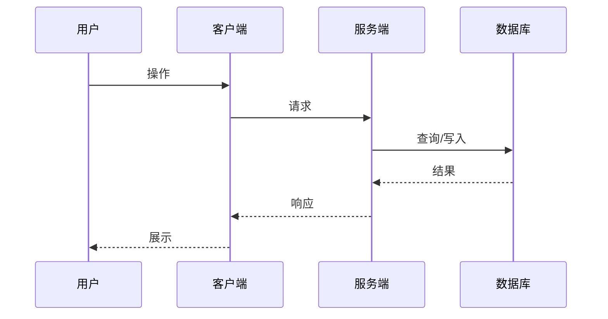

## TDD 开发计划

### 测试清单（对应 TC 用例）
| TC 用例 | 测试方法名 | 状态 |
|---------|-----------|------|

### 实现步骤（🔴 标准粒度：每步单一动作，可独立验证）

> 每个步骤应为 1 个原子操作（写测试 / 写实现 / 验证通过），而不是"实现 XXX 模块"这样的大块。
> 标准粒度确保：进度可衡量、Subagent 不会迷失在大任务中、Review 更频繁、commit 更原子。

| # | 步骤 | 类型 | 验证方式 | 状态 |
|---|------|------|----------|------|
| 1 | 写 XXX 失败测试 | 🔴 Red | 测试运行 → 失败 | ☐ |
| 2 | 实现 XXX 最小代码 | 🟢 Green | 测试运行 → 通过 | ☐ |
| 3 | 重构 XXX | 🔵 Refactor | 测试仍通过 | ☐ |
| 4 | 写 YYY 失败测试 | 🔴 Red | 测试运行 → 失败 | ☐ |
| ... | ... | ... | ... | ☐ |

> ❌ 反模式：`实现用户登录模块` — 太大，无法验证中间状态
> ✅ 正确粒度：`写 login API 401 测试` → `实现密码校验` → `写 login 成功测试` → `实现 token 生成`

## 待决策
| 问题 | 建议 |
|------|------|

## 变更记录
| 日期 | 变更 |
|------|------|
```

---

## PROJECT.md（项目总览）

> 位置：各子项目 `{子项目路径}/docs/PROJECT.md`（每个子项目各一份），全景入口为 `teamwork_space.md`
>
> 受众：**业务老板 / PM / 非技术人员** — 用业务语言描述项目全貌，不涉及代码实现细节。
> 用途：子项目的业务总览，串联产品定位、核心业务流程、功能模块（业务视角）、当前进度。技术细节见 📎 ARCHITECTURE.md。有 UI 的项目全景设计见 📎 design/sitemap.md。
> 更新时机：项目初始化时创建 / Feature Planning 完成后更新 / 业务流程或功能模块变更后更新

```markdown
# {项目名称}

## 项目简介

{一句话说清楚项目是什么、解决什么问题、面向谁}

## 核心业务流程

### 主要用户路径

{使用 Mermaid 流程图描述核心业务流程，如：}

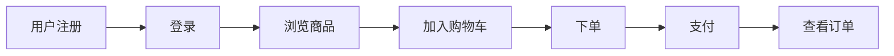

### 关键业务规则

| 规则 | 说明 |
|------|------|
| [规则1] | [描述] |

## 功能模块

### 模块总览

> 从业务视角描述系统的功能划分，说清楚「做什么」而非「怎么做」。

| 模块 | 做什么 | 面向谁 |
|------|--------|--------|
| [用户中心] | [注册、登录、个人信息管理] | [终端用户] |
| [商品管理] | [商品发布、分类、搜索] | [商家 / 运营] |
| [订单系统] | [下单、支付、退款] | [终端用户] |
| [运营后台] | [数据统计、配置管理] | [运营人员] |

### 模块间关系

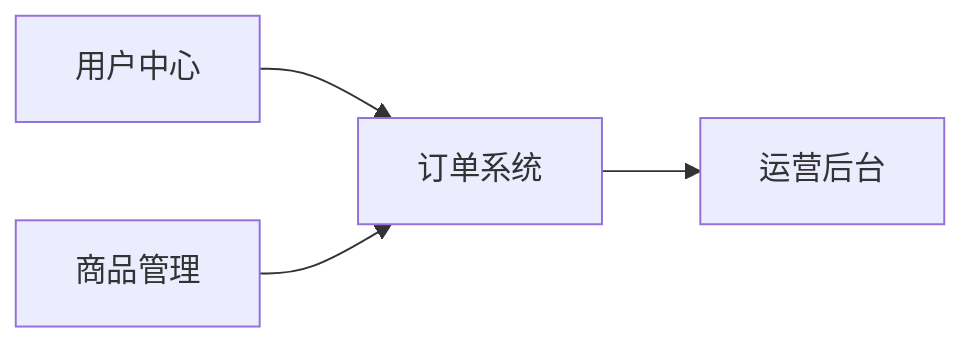

## 关键业务决策

| 决策 | 结论 | 业务原因 |
|------|------|----------|
| [为什么先做 X 不做 Y] | [结论] | [业务原因] |
| [为什么采用 A 方案] | [结论] | [业务原因] |

> 技术层面的设计决策见 📎 `{docs_root}/architecture/ARCHITECTURE.md`

## 当前状态

### 已完成功能

| 功能 | 描述 | 上线日期 |
|------|------|----------|
| [用户登录] | [描述] | [日期] |

### 开发中

| 功能 | 描述 | 预计完成 |
|------|------|----------|
| [用户注册] | [描述] | [日期] |

> 完整 Feature Roadmap 见 📎 `docs/ROADMAP.md`（如有）

## 变更记录

| 日期 | 变更 |
|------|------|
| [日期] | 项目初始化 |
```

**与其他文档的关系**：
- **teamwork_space.md**：全景入口，Mermaid 架构图 + 子项目链接，点击进入各子项目 PROJECT.md
- **PROJECT.md**（本文档）：业务视角 — 产品定位 + 业务流程 + 功能模块 + 进度（给业务老板看）
- **design/sitemap.md**：产品全景设计 — 页面地图 + 导航结构 + 全景原型（有 UI 的项目，给设计师和前端看）
- **ARCHITECTURE.md**：技术视角 — 技术栈选型 + 代码分层 + 模块依赖 + 接口规范（给技术团队看）
- **KNOWLEDGE.md**：开发过程中积累的经验和踩坑记录
- **ROADMAP.md**：PROJECT.md 的执行落地 — Feature 拆解 + 依赖关系 + 按 Wave 编排的执行批次（方便并行开多个 Claude）

**更新规则**：
```
触发更新的场景：
├── 项目初始化 → PMO 创建 PROJECT.md（首次）
├── Feature Planning 完成 → PMO 同步 Roadmap 到「当前状态」章节
├── 业务流程变更 → PMO 更新「核心业务流程」
├── 新增/变更功能模块 → PMO 更新「功能模块」章节
├── 新增业务决策 → PMO 更新「关键业务决策」表
└── 普通 Feature 完成 → PMO 仅更新「当前状态」章节

不需要更新的场景：
├── 纯技术重构（无业务影响）→ 仅更新 ARCHITECTURE.md
├── Bug 修复（除非涉及业务流程调整）
└── 问题排查
```

---

## ARCHITECTURE.md

> 受众：**技术团队（RD / 架构师）** — 代码级技术细节，技术栈选型、分层架构、模块依赖、接口规范。
> 业务层面的产品概览见 📎 PROJECT.md。

```markdown
# {项目名} 架构文档

> 技术层面的 Single Source of Truth。详细设计按领域拆分到子文档，本文件为全景索引。
> 业务层面的产品概览见 📎 PROJECT.md。

## 最后更新
{日期} - {更新内容简述}

## 一、技术栈概览

| 类别 | 选型 | 选型原因 |
|------|------|----------|
| 语言 | [如 TypeScript] | [原因] |
| 前端框架 | [如 React / Vue / Next.js] | [原因] |
| 后端框架 | [如 Express / NestJS / FastAPI] | [原因] |
| 数据库 | [如 PostgreSQL / MongoDB] | [原因] |
| 缓存 | [如 Redis] | [原因] |
| 基础设施 | [如 Docker / K8s / AWS] | [原因] |
| CI/CD | [如 GitHub Actions] | [原因] |

## 二、架构概述

### 2.1 架构图
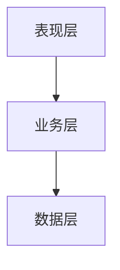

### 2.2 目录结构
```
src/
├── api/          # API 接口层
├── services/     # 业务服务层
├── models/       # 数据模型层
├── utils/        # 工具类
└── config/       # 配置文件
```

## 三、分层与职责

### 3.1 表现层（Presentation Layer）
- 职责：
- 包含模块：
- 规范要求：

### 3.2 业务层（Business Layer）
- 职责：
- 包含模块：
- 规范要求：

### 3.3 数据层（Data Layer）
- 职责：
- 包含模块：
- 规范要求：

## 四、核心模块说明

### 4.1 {模块名}
- 职责：
- 对外接口：
- 依赖模块：
- 关键类/文件：
- 模块间依赖关系：

## 五、子文档索引

> 以下子文档包含各领域的详细设计。随项目演进按需创建，初期可不创建。

| 子文档 | 内容 | 创建时机 |
|--------|------|----------|
| 📎 [database-schema.md](./database-schema.md) | 数据库 schema 设计、ER 图、核心表说明、分库分表策略 | 有数据库设计时 |
| 📎 [api-design.md](./api-design.md) | API 总览、版本策略、核心接口清单、认证方案 | 有 API 设计时 |
| 📎 [deployment.md](./deployment.md) | 部署架构、环境拓扑、基础设施、CI/CD pipeline | 需要部署说明时 |

### 子文档管理规则

```
📎 子文档由架构师在 Code Review 时按需创建和维护
├── 初始项目可以不创建，所有内容先写在本文件中
├── 当本文件某一领域内容超过 50 行时，拆分到对应子文档
├── 拆分后在本文件「子文档索引」中更新链接
└── 子文档与本文件保持相同的变更记录规范
```

## 六、技术设计决策

> 🔴 **决策归属判断**：遇到设计决策时，按以下标准判断写在哪里。
>
> | 决策性质 | 归属 | 示例 |
> |----------|------|------|
> | 跨 Feature 的架构原则/设计标准 | 本表 + 子文档的「设计原则」章节 | JSONB 拍平标准、API 版本策略、缓存策略 |
> | 单个 Feature 的技术选型 | Feature 的 TECH.md「待决策」 | 用 WebSocket 还是 SSE |
> | 单个 Feature 的产品决策 | Feature 的 PRD「待决策项」 | 先做 A 还是先做 B |
> | 业务层面的战略决策 | PROJECT.md「关键业务决策」 | 为什么选这个商业模式 |
> | 开发中踩坑的经验 | KNOWLEDGE.md | 某库在某场景下会崩溃 |
>
> 📎 关键判断：**这个决策在下一个 Feature 中还需要遵守吗？** 是 → architecture；否 → PRD/TECH.md。

| 日期 | 决策 | 原因 | 影响范围 |
|------|------|------|----------|

> 业务层面的决策见 📎 PROJECT.md「关键业务决策」

## 七、变更记录

| 日期 | 版本 | 变更内容 | 变更人 |
|------|------|----------|--------|
```

### ARCHITECTURE.md 子文档模板

#### database-schema.md

```markdown
# 数据库 Schema 设计

> 📎 独立文档，存放于 standards/ 目录，由架构师全阶段维护。与 ARCHITECTURE.md 的关系：ARCHITECTURE.md 描述整体架构设计，本文档专注数据库表结构、ORM 映射登记及 SQL 引用点追踪。

## 最后更新
{日期} - {更新内容简述}

## 设计原则

> 🔴 跨 Feature 长期有效的 DB 设计标准写在这里，不要埋在单个 Feature 的 PRD 或 TECH.md 中。
> 各 Feature 的 TECH.md 应引用本节标准（`📎 详见 database-schema.md 设计原则`），而非重新定义。

### {原则名称}（示例：JSONB + 拍平列策略）

{原则描述 + 判断标准}

> 📎 每个新增原则需记录到 ARCHITECTURE.md「技术设计决策」表中（决策日期 + 原因 + 影响范围）。

## ER 关系图

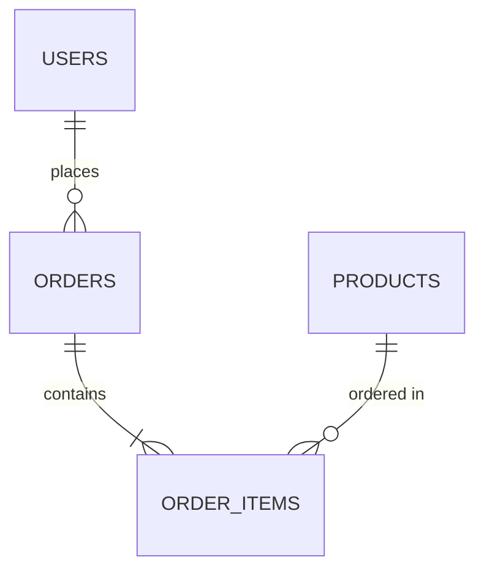

## 核心表说明

### {表名}
- 用途：
- 核心字段：

| 字段 | 类型 | 说明 | 索引 |
|------|------|------|------|

- 关联关系：

**Model/Struct 映射**（🔴 架构师维护，schema 变更时必须同步更新）：

| Model/Struct | 所在子项目 | 文件路径 | ORM 框架 | 说明 |
|-------------|-----------|---------|---------|------|
| PlanRow | BE | src/models/plan.rs | sqlx FromRow | 主 Model |
| PlanRow | ADM | src/repo/plan.rs | sqlx FromRow | 跨子项目引用 |

> 📎 此表记录所有引用该表的 Model/Struct 及其位置。当 migration 变更该表时，RD 必须逐行检查此表中列出的所有 Model 和对应 SQL 查询是否同步更新。
> 架构师 Code Review 时对照此表验证变更完整性。

**SQL 查询引用点**（涉及跨子项目引用时必填）：

| SQL 引用 | 所在子项目 | 文件路径 | 查询类型 | 说明 |
|----------|-----------|---------|---------|------|
| find_active_plan | ADM | src/repo.rs:L42 | SELECT | query_as PlanRow |
| extend_plan | ADM | src/repo.rs:L78 | RETURNING | query_as PlanRow |

> 📎 此表记录引用该表 Struct 的关键 SQL 查询。当表增删列时，这些 SQL 的列列表必须同步修改（缺列 → ORM 反序列化报错 → 500）。

## 分库分表策略（如有）

| 维度 | 策略 | 说明 |
|------|------|------|

## 变更记录

| 日期 | 版本 | 变更内容 | 影响子项目 | 变更人 |
|------|------|----------|-----------|--------|
```

#### api-design.md

```markdown
# API 设计总览

> 隶属于 📎 [ARCHITECTURE.md](./ARCHITECTURE.md)，API 层面的详细设计。

## 最后更新
{日期} - {更新内容简述}

## 版本策略

```
当前活跃版本：v1
版本路径格式：/api/v{N}/...
```

## 版本清单

| 版本 | 状态 | 说明 |
|------|------|------|
| v1 | ✅ 活跃 | 当前版本 |

## 核心接口清单

### {模块名}

| 方法 | 路径 | 说明 | 版本 |
|------|------|------|------|
| POST | /api/v1/auth/login | 用户登录 | v1 |

## 认证方案

- 认证方式：
- Token 格式：
- 刷新机制：

## 变更记录

| 日期 | 版本 | 变更内容 | 变更人 |
|------|------|----------|--------|
```

#### deployment.md

```markdown
# 部署架构

> 隶属于 📎 [ARCHITECTURE.md](./ARCHITECTURE.md)，部署和基础设施的详细设计。

## 最后更新
{日期} - {更新内容简述}

## 环境拓扑

| 环境 | 用途 | 地址 | 说明 |
|------|------|------|------|
| dev | 开发联调 | | |
| staging | 预发布验证 | | |
| production | 线上环境 | | |

## 部署架构图

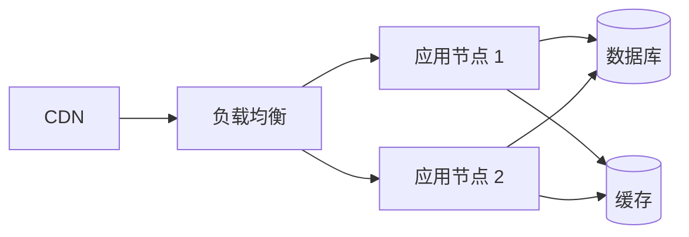

## CI/CD Pipeline

```
代码提交 → 自动测试 → 构建镜像 → 部署到 staging → 人工验证 → 部署到 production
```

## 变更记录

| 日期 | 版本 | 变更内容 | 变更人 |
|------|------|----------|--------|
```

---

## design/ 产品全景设计（有 UI 的子项目按需创建）

> 位置：`{子项目路径}/docs/design/`
> 适用：前端、客户端、任何有 UI 的子项目。纯后端/服务项目无需创建。
> 用途：产品级别的页面地图 + 全景交互原型。与 Feature 级 UI 设计（`features/{编号}/preview/`）互补：design/ 看全貌，Feature preview/ 看单功能细节。

### sitemap.md

```markdown
# {子项目名} 页面地图

> 产品全景设计入口。业务流程见 📎 PROJECT.md，技术架构见 📎 ARCHITECTURE.md。
> 全景交互原型见 📎 [design/preview/](./preview/)

## 最后更新
{日期} - {更新内容简述}

## 页面导航结构

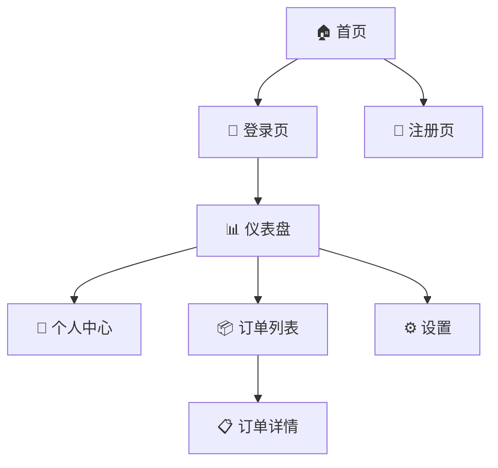

## 页面清单

| 页面 | 路由 | 描述 | 对应 Feature | 状态 |
|------|------|------|-------------|------|
| 首页 | / | 产品入口页 | {缩写}-F001 | ✅ 已实现 |
| 登录页 | /login | 用户登录 | {缩写}-F002 | ✅ 已实现 |
| 仪表盘 | /dashboard | 核心功能面板 | {缩写}-F003 | 🔄 开发中 |

## 全局设计说明（可选）

### 导航规则
- 未登录 → 重定向到登录页
- 登录后默认进入仪表盘

### 通用交互模式
- 列表页统一分页方式
- 表单统一校验提示样式
- 错误页统一处理

## 变更记录
| 日期 | 变更 |
|------|------|
```

### design/preview/ 全景交互原型

```
📁 design/preview/ 目录说明：
├── overview.html          ← 全景入口（缩略卡片 + 流程路径 + 跳转到各页面）
├── {页面名}.html          ← 各核心页面的完整交互原型（可相互跳转）
│   ├── login.html         ← 登录页
│   ├── register.html      ← 注册页
│   ├── dashboard.html     ← 首页/仪表盘
│   └── ...                ← 其他核心页面
└── 用户打开 overview.html → 点击卡片跳转到各页面 → 页面间可互相跳转体验完整流程

⚠️ 与 Feature 级 preview/ 的区别：
├── design/preview/：产品级多页交互原型，可体验完整用户流程
├── features/{编号}/preview/：单功能级细节，展示具体页面的各种状态（正常/加载/空/错误）
└── 两者关系：design/preview/ 是全景权威版本，Feature preview/ 是开发参照

📌 维护时机（🔴 强制，每次 UI 设计都必须执行）：
├── Feature Planning 全景重建时：Designer 从零重建全部页面 HTML + overview.html
├── 每次 Feature UI 设计后：
│   ├── 同步 sitemap.md 页面清单和导航图
│   ├── 新增页面 → 在 design/preview/ 中创建对应 HTML
│   ├── 修改页面 → 同步更新 design/preview/ 中对应 HTML
│   └── 更新 overview.html 全景入口（新增/变更页面高亮标注）
└── design/ 是产品 UI 的 Single Source of Truth
```

---

## Feature STATUS.md 模板

> 位置：`{docs_root}/features/{缩写}-F{编号}-{功能名}/STATUS.md`
> 🔴 PMO 每次阶段流转时必须更新此文件。

```markdown
# Feature 状态

| 字段 | 值 |
|------|-----|
| Feature | {缩写}-F{编号}-{功能名} |
| 当前阶段 | {阶段名称} |
| 当前角色 | {角色} |
| 最后更新 | {YYYY-MM-DD HH:mm} |
| 阻塞状态 | 无 / ⏳ {阻塞原因} |
| 业务关联 | - / BG-{三位数字}-{业务目标简述} |

## 阶段历史

| 阶段 | 进入时间 | 退出时间 | 备注 |
|------|----------|----------|------|
| PM 编写 PRD | {时间} | {时间} | |
| PL-PM Teams 讨论 | {时间} | {时间} | |
| PRD 评审 | {时间} | {时间} | |
| PRD 待确认 | {时间} | {时间} | |
| Designer 设计 | {时间} | {时间} | 无 UI 时跳过 |
| UI 待确认 | {时间} | {时间} | 无 UI 时跳过 |
| QA 编写 TC | {时间} | {时间} | |
| TC 评审 | {时间} | {时间} | |
| RD 技术方案 | {时间} | {时间} | |
| 架构师 Review | {时间} | {时间} | |
| 技术方案待确认 | {时间} | {时间} | |
| RD 开发+自查 | {时间} | {时间} | |
| 架构师 Code Review | {时间} | {时间} | |
| UI 还原验收 | {时间} | {时间} | 无 UI 时跳过 |
| QA 代码审查 | {时间} | {时间} | |
| QA 集成测试前置检查 | {时间} | {时间} | |
| QA 集成测试 | {时间} | {时间} | |
| QA E2E 验收 | {时间} | {时间} | 子项目未启用 E2E 时跳过 |
| PM 验收 | {时间} | {时间} | |
| ✅ 已完成 | {时间} | - | |
```

**当前阶段的合法值**（对齐 SKILL.md「阶段与下一步对照表」的「阶段」列，唯一权威来源）：
```
PM 编写 PRD → PL-PM Teams 讨论 → PRD 评审 → PRD 待确认 →
Designer 设计 → UI 待确认 →
QA 编写 TC → TC 评审 → RD 技术方案 → 架构师 Review →
技术方案待确认 → RD 开发+自查 → 架构师 Code Review →
UI 还原验收 → QA 代码审查 → QA 集成测试前置检查 →
QA 集成测试 → QA E2E 验收 →
PM 验收 → ✅ 已完成

特殊状态：⏳ 等待外部依赖 / RD Bug 排查
```
> 🔴 STATUS.md「当前阶段」使用上述阶段名（无 emoji 前缀）。PMO 阶段摘要中的「状态行显示」可带 emoji（如 🤖、⏸️），但 STATUS.md 字段值必须与此处一致。

**显示名映射**（状态行「阶段」字段的进行中显示 → 规范名对照）：

| 规范名 | 状态行进行中显示 | 说明 |
|--------|-----------------|------|
| PM 编写 PRD | PRD 编写中 | |
| PL-PM Teams 讨论 | 🤖 PL-PM 讨论中（Teams） | |
| RD 技术方案 | 技术方案中 | |
| 技术方案待确认 | ⏸️ 方案待确认 | 简写 |
| RD 开发+自查 | 🤖 Subagent 执行中 | 同其他 Subagent 阶段 |
| QA 集成测试前置检查 | 环境准备中 | |
| RD Bug 排查 | Bug 排查中 | Bug 处理流程 |
| PMO Bug 判断 | PMO 流程判断 | Bug 处理流程 |
| QA 补充用例 | QA 补充用例中 | Bug 处理流程 |
| RD Bug 修复 | Bug 修复中 | Bug 处理流程 |
| RD Bug 自查 | Bug 自查中 | Bug 处理流程 |
| QA Bug 验证 | QA 验证中 | Bug 处理流程 |
| PM 文档同步 | 文档同步检查中 | Bug 处理流程 |
| PMO Bug 总结 | PMO 总结中 | Bug 处理流程 |
| 问题排查梳理 | 问题排查中 | 问题排查流程 |
| 排查待确认 | ⏸️ 排查待确认 | 问题排查流程 |
| PM Roadmap 编写 | Roadmap 编写中 | Feature Planning |
| Roadmap 待确认 | ⏸️ Roadmap 待确认 | Feature Planning |
| 🌐 Workspace 架构讨论 | 架构讨论中 | Workspace Planning |
| 🌐 teamwork_space.md 待确认 | ⏸️ teamwork_space.md 待确认 | Workspace Planning |
| 🌐 子项目 Planning 中 | 子项目 [缩写] Planning | Workspace Planning |
| 🌐 Workspace Planning 收尾 | ⏸️ 最终确认 | Workspace Planning |
| PL 引导模式 | PL 引导（草案迭代中） | PL 模式 |
| PL 讨论模式 | PL 讨论中 | PL 模式 |
| PL 结论待确认 | ⏸️ PL 结论待确认 | PL 模式 |
| PL 执行模式 | PL 变更评估中 | PL 模式 |
| CHG 待确认 | ⏸️ CHG 待确认 | PL 模式 |
| ⏳ 等待外部依赖 | ⏳ 等待外部依赖（DEP-XXX） | 通用 |

> 📎 未列出的阶段，显示名 = 规范名 + "中"后缀（如 "PM 验收" → "PM 验收中"）。

**PMO 更新规则**：
```
├── 每次 PMO 阶段摘要时 → 更新 STATUS.md 的「当前阶段」「当前角色」「最后更新」
├── 阶段流转时 → 在「阶段历史」表追加/更新对应行的退出时间
├── Feature 完成时 → 当前阶段设为「✅ 已完成」
└── 🔴 STATUS.md 是 Feature 状态的 Single Source of Truth
```

---

## PL-FEEDBACK-R{N}.md（PL 审查反馈）

> 📎 由 PL Agent 在 PL-PM Teams 讨论中输出，存放于 `{feature_path}/discuss/`

```markdown
# PL 审查反馈 — 第 {N} 轮

## ✅ 对齐点
<!-- PRD 中与业务目标一致的部分 -->
- [逐条列出，引用 PRD 对应章节]

## ❓ 质疑点
<!-- 🔴 每条必须引用业务文档具体条目作为论据 -->
| 序号 | PRD 内容 | 业务文档依据 | 质疑理由 |
|------|----------|-------------|----------|
| 1 | [PRD 中的具体描述] | [product-overview 或执行手册中的条目] | [不一致/遗漏/偏离的具体说明] |

## ➕ 补充点
<!-- PRD 遗漏的业务维度 -->
- [逐条列出，引用业务文档支撑]

## ⚠️ 风险点
<!-- 跨执行线/跨子项目影响 -->
- [逐条列出，说明影响范围和建议]
```

## PM-RESPONSE-R{N}.md（PM 回应反馈）

> 📎 由 PM Agent 在 PL-PM Teams 讨论中输出，存放于 `{feature_path}/discuss/`

```markdown
# PM 回应 — 第 {N} 轮

## 接受项
<!-- 同意 PL 意见，写明 PRD 修改方案 -->
| 序号 | PL 反馈 | 修改方案 | 已更新到 PRD |
|------|---------|----------|-------------|
| 1 | [对应 PL 质疑/补充] | [具体修改内容] | ✅ / 📝 |

## 解释项
<!-- 补充 PL 不了解的技术背景/约束 -->
| 序号 | PL 反馈 | 解释说明（引用代码架构） |
|------|---------|------------------------|
| 1 | [对应 PL 质疑] | [技术约束/实现背景] |

## 反驳项
<!-- 给出理由 + 替代方案 -->
| 序号 | PL 反馈 | 反驳理由 | 替代方案 |
|------|---------|----------|----------|
| 1 | [对应 PL 质疑] | [技术/产品理由] | [可选替代方案] |

## 分歧项
<!-- 标记为待用户决策 -->
| 序号 | PL 观点 | PM 观点 | 建议 |
|------|---------|---------|------|
| 1 | [PL 立场] | [PM 立场] | ⏸️ 待用户决策 |
```

---

## Bugfix 文档模板

```markdown
# BUG-{编号}: {问题简述}

## 状态
已修复 | 修复中

## 问题描述
- 现象：
- 复现步骤：
- 影响范围：

## 原因分析

## 修复方案
- 修复层级：根因修复 / 症状修复（若为症状修复需说明原因）

## 修复验证
- [ ] 问题已修复
- [ ] 修复的是根因而非绕过症状
- [ ] 相关功能未受影响

## 变更记录
| 日期 | 变更 |
|------|------|
```

---

## Optimization 文档模板

```markdown
# OPT-{编号}: {优化简述}

## 状态
已完成 | 进行中

## 优化目标

## 优化方案

## 设计预览
- [优化后效果](./preview/opt-001-xxx.html)

## 验收标准
- [ ]

## 变更记录
| 日期 | 变更 |
|------|------|
```

---

## Decision 文档模板

```markdown
# DEC-{编号}: {决策主题}

## 状态
已决策 | 讨论中

## 背景
为什么需要做这个决策

## 选项

### 选项 A: {名称}
- 描述：
- 优点：
- 缺点：

### 选项 B: {名称}
- 描述：
- 优点：
- 缺点：

## 决策
选择 [选项 X]

## 理由

## 影响范围

## 变更记录
| 日期 | 变更 |
|------|------|
```

---

## RESOURCES.md（资源依赖配置）

> 位置：`docs/RESOURCES.md`（项目级，非功能级）

```markdown
# 资源依赖配置

> 本文件记录项目开发和测试所需的外部资源配置，首次配置后后续自动复用。

## 数据库配置

### Dev 环境
| 配置项 | 值 |
|--------|-----|
| Host | |
| Port | |
| Database | |
| Username | |
| Password | ⚠️ 敏感信息，建议使用环境变量 |
| 连接字符串 | |

### Test 环境
| 配置项 | 值 |
|--------|-----|
| Host | |
| Port | |
| Database | |

## 第三方服务配置

### {服务名，如 Redis/MQ/OSS}
| 配置项 | 值 |
|--------|-----|
| Endpoint | |
| AccessKey | ⚠️ |
| SecretKey | ⚠️ |

## 测试账号

| 用途 | 账号 | 密码 | 获取方式 | 备注 |
|------|------|------|----------|------|
| 普通用户 | | | 自主注册 | |
| 管理员 | | | 用户提供 | |
| VIP用户 | | | 用户提供 | |

## API 配置

| 环境 | Base URL | 备注 |
|------|----------|------|
| Dev | | |
| Test | | |
| Prod | | 仅查看，禁止测试 |

## 配置使用说明

```bash
# 环境变量方式（推荐）
export DB_HOST=xxx
export DB_PASSWORD=xxx

# 或使用 .env 文件（已加入 .gitignore）
cp .env.example .env
# 编辑 .env 填入实际值
```

## 变更记录
| 日期 | 变更 | 操作人 |
|------|------|--------|
```

---

## external/README.md（三方资源目录说明）

> 位置：项目根 `external/README.md`
> 🔴 PMO 初始化项目时自动创建 `external/` 目录和此 README。

```markdown
# 三方 / 外部资源文档

> 本目录集中存放项目依赖的所有三方服务、SDK、外部 API 的接入文档和参考资料。
> 按三方服务名称分子目录，方便一眼识别整个项目用了哪些外部依赖。

## 目录结构

```
external/
├── README.md              ← 本文件（三方资源总览索引）
├── {三方服务A}/            # 如：wechat-pay/
│   ├── 接入指南.md         # 接入流程、前置条件、配置步骤
│   ├── API参考.md          # 接口文档、请求/响应格式
│   └── ...                # SDK 文档、示例代码等
├── {三方服务B}/
│   └── ...
└── ...
```

## 三方资源索引

| 三方服务 | 子目录 | 使用方子项目 | 用途 | 状态 |
|----------|--------|-------------|------|------|
| | | | | 接入中 / 已接入 / 已弃用 |

> **使用方子项目**：填写依赖该三方资源的子项目缩写（如 PAY, WEB），便于评估三方变更的影响面。
> **状态**：`接入中` = 正在对接；`已接入` = 生产可用；`已弃用` = 已迁移到替代方案，保留文档供参考。

## 使用规范

1. **新增三方依赖**：创建子目录，至少包含一份接入指南，并在上方索引表中登记
2. **子目录命名**：统一使用 kebab-case（如 `wechat-pay/`、`alipay-sdk/`、`google-maps/`）
3. **三方 SDK/包**：存放官方文档副本或链接，不存放 SDK 二进制文件（二进制通过包管理器安装）
4. **敏感信息**：API Key、Secret 等配置不放在此目录，统一在 `docs/RESOURCES.md` 中管理
5. **弃用三方**：状态改为「已弃用」，子目录保留（历史参考），在接入指南中注明替代方案
```

---

## TEST-DATA.md（测试数据集）

> 位置：`docs/TEST-DATA.md`（项目级）

```markdown
# 测试数据集

> 本文件记录集成测试使用的测试数据，方便后续回归测试复用。
> ⚠️ init.sql / seed 脚本中的字段需与最新 migration 保持同步。RD 新增/修改数据库字段时，必须同步更新测试数据文件。

## 通用测试数据

### 用户数据
| ID | 用户名 | 邮箱 | 角色 | 用途 | 创建方式 |
|----|--------|------|------|------|----------|
| test_user_001 | testuser1 | test1@example.com | 普通用户 | 基础功能测试 | 自动注册 |
| test_admin_001 | testadmin | admin@example.com | 管理员 | 权限测试 | 用户提供 |

### 订单数据
| ID | 关联用户 | 状态 | 金额 | 用途 |
|----|----------|------|------|------|
| test_order_001 | test_user_001 | 待支付 | 100.00 | 支付流程测试 |
| test_order_002 | test_user_001 | 已完成 | 200.00 | 订单查询测试 |

## 功能专用测试数据

### F001-用户登录
| 场景 | 测试数据 | 预期结果 |
|------|----------|----------|
| 正常登录 | user: testuser1, pwd: Test123456 | 登录成功 |
| 密码错误 | user: testuser1, pwd: wrong | 返回错误 |
| 用户不存在 | user: notexist | 返回错误 |

### F002-xxx
...

## 数据清理规则

```
测试前：
├── 检查测试数据是否存在
├── 不存在则自动创建
└── 存在则复用

测试后：
├── 保留基础测试数据（方便复用）
├── 清理本次测试产生的临时数据
└── 重置被修改的测试数据状态
```

## 数据生成脚本

```bash
# 生成测试数据
npm run test:seed

# 清理测试数据
npm run test:clean

# 重置测试数据
npm run test:reset
```

## 变更记录
| 日期 | 变更 | 功能 |
|------|------|------|
```

---

## integration_test/（集成测试前置数据目录）

> 位置：`docs/integration_test/`（项目级）
> 用途：存放 Docker compose 配置和各服务的前置数据，Docker 启动后自动加载，确保集成测试可重复执行。

### 目录结构

```
docs/integration_test/
├── docker-compose.test.yml    # 测试环境 compose（QA 自动生成或手动维护）
├── pg/                        # PostgreSQL 前置数据
│   ├── init.sql               # 建表 + 初始数据（Docker 启动时自动执行）
│   └── seed_F001.sql          # F001 功能专用测试数据（按需）
├── mysql/                     # MySQL 前置数据（如使用）
│   ├── init.sql
│   └── seed_F001.sql
├── redis/                     # Redis 前置数据（如使用）
│   └── seed.redis             # Redis CLI 命令格式，用 `redis-cli < seed.redis` 加载
├── mongo/                     # MongoDB 前置数据（如使用）
│   └── init.js                # mongosh 脚本
└── README.md                  # 说明文档（数据用途、加载方式、更新规则）
```

### docker-compose.test.yml 模板

```yaml
# 由 QA 集成测试阶段自动生成，也可手动维护
# 用法: docker compose -f docs/integration_test/docker-compose.test.yml up -d

services:
  postgres:
    image: postgres:16-alpine
    environment:
      POSTGRES_DB: test_db
      POSTGRES_USER: test
      POSTGRES_PASSWORD: test123
    ports:
      - "5432:5432"
    volumes:
      - ./pg:/docker-entrypoint-initdb.d    # 自动执行 init.sql
    healthcheck:
      test: ["CMD-SHELL", "pg_isready -U test"]
      interval: 5s
      timeout: 3s
      retries: 5

  redis:
    image: redis:7-alpine
    ports:
      - "6379:6379"
    healthcheck:
      test: ["CMD", "redis-cli", "ping"]
      interval: 5s
      timeout: 3s
      retries: 5
```

### init.sql 模板（以 PostgreSQL 为例）

```sql
-- docs/integration_test/pg/init.sql
-- 集成测试基础数据，Docker 启动时自动执行

-- 建表（如项目无 migration 工具）
CREATE TABLE IF NOT EXISTS users (
    id SERIAL PRIMARY KEY,
    username VARCHAR(50) NOT NULL,
    email VARCHAR(100) NOT NULL,
    password_hash VARCHAR(255) NOT NULL,
    role VARCHAR(20) DEFAULT 'user',
    created_at TIMESTAMP DEFAULT NOW()
);

-- 基础测试数据
INSERT INTO users (username, email, password_hash, role) VALUES
    ('testuser1', 'test1@example.com', '$2b$10$xxxhashed', 'user'),
    ('testadmin', 'admin@example.com', '$2b$10$xxxhashed', 'admin')
ON CONFLICT DO NOTHING;
```

### seed.redis 模板

```redis
-- docs/integration_test/redis/seed.redis
-- 用法: redis-cli < docs/integration_test/redis/seed.redis

SET config:site_name "TestApp"
SET config:max_login_attempts "5"
HSET user:session:template ttl 3600 refresh 7200
```

### 管理规则

```
前置数据维护规则：
├── 新功能开发时 → RD/QA 按需新增 seed_F{编号}.sql
├── init.sql 只放通用基础数据（所有功能都需要的）
├── 功能专用数据用独立文件 seed_F{编号}.sql
├── compose 文件的 volumes 挂载整个目录，SQL 按文件名顺序执行
├── 数据变更后 → 更新对应 seed 文件，保持可重复执行（使用 ON CONFLICT / IF NOT EXISTS）
└── docker-compose.test.yml 变更后 → 需重新 `docker compose down && up -d`
```

---

## ROADMAP.md（产品执行路线图）

> 位置：`docs/ROADMAP.md`（项目级）或 `{子项目路径}/docs/ROADMAP.md`（子项目级）
> 触发：Feature Planning 流程中 PM 基于已确认的 PROJECT.md 产出；技术债由 RD/架构师在开发过程中追加
> 用途：PROJECT.md 的执行落地文档。将业务目标拆解为可执行的 Feature 序列，按依赖关系编排执行批次（Wave），标注并行度，方便开多个 Claude 同时执行。

```markdown
# {产品名称} - Roadmap

> 状态：📝 草稿 | ⏸️ 待确认 | ✅ 已确认 | 🔄 重新规划中

## 产品目标

[引用 PROJECT.md 中的核心目标，不重复展开]

📎 完整业务描述见 [PROJECT.md](./PROJECT.md)

## 执行批次（Wave）

> 按依赖关系分批，同一 Wave 内的 Feature 无依赖、可并行执行（开多个 Claude）。
> Wave 之间串行：前一个 Wave 全部完成后，才能开始下一个 Wave。

### Wave 1（并行度：X 个 Claude）

| Feature ID | 功能名称 | 优先级 | 描述 | 核心验收标准 | 依赖 | 状态 | 当前阶段 | 对应 F编号 |
|-----------|---------|--------|------|-------------|------|------|----------|----------|
| BL-001 | [功能名] | P0 | [一句话描述] | ① [关键标准1] ② [关键标准2] | 无 | 待开始 | - | - |
| BL-002 | [功能名] | P0 | [一句话描述] | ① [关键标准1] ② [关键标准2] | 无 | 待开始 | - | - |
| BL-003 | [功能名] | P1 | [一句话描述] | ① [关键标准1] | 无 | 待开始 | - | - |

> ✅ 完成条件：Wave 1 全部 Feature 状态为「已完成」后进入 Wave 2

### Wave 2（并行度：X 个 Claude，前置：Wave 1）

| Feature ID | 功能名称 | 优先级 | 描述 | 核心验收标准 | 依赖 | 状态 | 当前阶段 | 对应 F编号 |
|-----------|---------|--------|------|-------------|------|------|----------|----------|
| BL-004 | [功能名] | P0 | [一句话描述] | ① [关键标准1] ② [关键标准2] | BL-001 | 待开始 | - | - |
| BL-005 | [功能名] | P1 | [一句话描述] | ① [关键标准1] | BL-002 | 待开始 | - | - |

> ✅ 完成条件：Wave 2 全部 Feature 状态为「已完成」后进入 Wave 3

**ROADMAP「当前阶段」列合法值**：
```
- : 未开始
PM 编写 PRD / PL-PM 讨论中 / Designer 设计 / QA 编写 TC / RD 技术方案 /
RD 开发中 / Code Review / QA 审查中 / 集成测试中 / PM 验收中 /
⏳ 等待外部依赖 / ✅ 已完成
```
> 🔴 ROADMAP 的「当前阶段」使用简化名称（空间有限），STATUS.md 中有完整阶段历史。

### Wave N ...

## 依赖关系

### 依赖图（Mermaid）

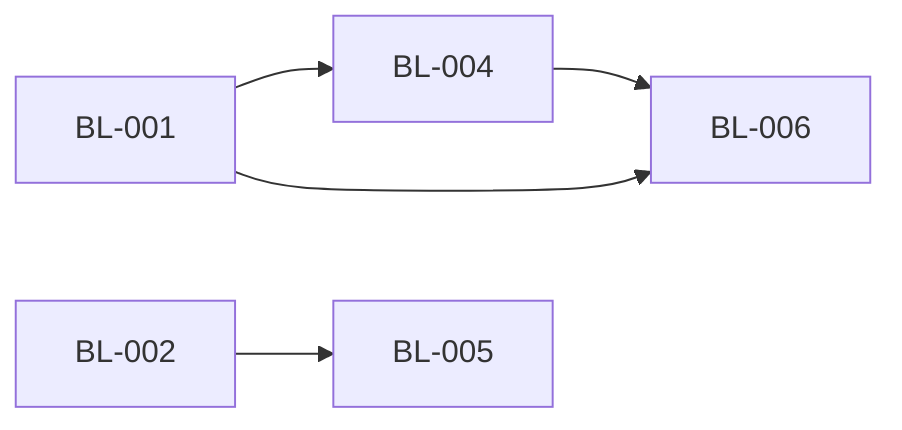

### 依赖说明

| Feature | 依赖 | 原因 |
|---------|------|------|
| BL-004 | BL-001 | [如：需要 BL-001 的用户认证接口] |
| BL-005 | BL-002 | [如：需要 BL-002 的数据模型] |

## 技术债清单

> 开发过程中产生的技术妥协、临时方案。由 RD 在完成报告中识别，PMO 写入。
> 技术债清理可作为独立 Feature 编入后续 Wave，也可在相关功能迭代时顺带清理。

| 债务 ID | 描述 | 产生原因 | 影响范围 | 严重程度 | 建议清理时间 | 来源 | 状态 |
|---------|------|----------|----------|----------|-------------|------|------|
| TD-001 | [一句话描述] | [为什么妥协] | [影响哪些模块] | 🔴高/🟡中/🟢低 | [如：Wave 3] | F001 | 待清理 |

## 变更记录

| 日期 | 变更 |
|------|------|
| [日期] | 初始规划 |
```

**字段说明**：
- **Feature ID**：`BL-{三位数字}`，Roadmap 内唯一编号，是 Feature 在规划阶段的标识。Feature 进入 Feature 流程后由 PMO 分配 `F{编号}`（执行编号），两者通过「对应 F编号」列建立映射
- **债务 ID**：`TD-{三位数字}`，技术债唯一编号
- **优先级**：`P0`（核心）/ `P1`（重要）/ `P2`（可选）——决定是否进入当前规划
- **描述**：一句话说明功能做什么
- **核心验收标准**：2-3 条最关键的验收标准（用 ①②③ 编号），确保即使 PRD 丢失也能重建需求。不需要穷举，只写决定性的标准
- **状态**：Feature 用 `待开始` / `进行中` / `⏳ 等待外部依赖` / `已完成` / `已取消`；技术债用 `待清理` / `清理中` / `已清理`
- **当前阶段**：状态为 `进行中` 时填写实际阶段（如 `RD 开发中`、`QA 审查中`），`待开始` / `已完成` 时填 `-`。PMO 每次阶段流转时同步更新
- **阻塞标注**：状态为 `⏳ 等待外部依赖` 时，在状态列附注阻塞原因，格式：`⏳ 等待外部依赖（DEP-XXX@模块缩写）`
- **对应 F编号**：Feature 进入 Feature 流程后填写（如 `F001-用户登录`），实现 Roadmap → Feature 追踪
- **依赖**：填 Feature ID（如 `BL-001`），无依赖填 `无`
- **并行度**：同一 Wave 内无互相依赖的 Feature 数量，即可同时开几个 Claude 执行

**Wave 编排规则**：
- 无依赖的 Feature 放入 Wave 1
- 依赖 Wave N 中 Feature 的，放入 Wave N+1（或更后）
- 同一 Wave 内的 Feature 之间不能有依赖
- PM 编排时应尽量最大化每个 Wave 的并行度
- P2 可选功能可以单独编排在最后的 Wave，也可以与同 Wave 的 P0/P1 并行

---

## BUG-REPORT.md（Bug 排查报告）
> 位置：`docs/features/F{编号}-{功能名}/bugfix/BUG-F{编号}-{序号}-{简述}.md`
> 编号规则：详见 [RULES.md](./RULES.md) - 编号规则章节

```markdown
# Bug 排查报告：{Bug 简述}

## 状态
🔍 排查中 | 📋 已分析 | 🔧 修复中 | ✅ 已修复

---

## 问题描述
**报告人**：[用户]
**报告时间**：[时间]
**问题描述**：
[用户报告的问题]

**期望行为**：
[应该是什么样的]

**实际行为**：
[实际发生了什么]

---

## 复现步骤
1. [步骤1]
2. [步骤2]
3. ...

**复现环境**：
- 浏览器/设备：
- 账号类型：
- 其他条件：

---

## 根因分析（RD 填写）

### 相关代码
| 文件 | 行号 | 问题描述 |
|------|------|----------|
| | | |

### 问题原因
[技术层面的原因描述]

### 调用链路
```
[入口] → [模块A] → [模块B] → [问题点]
```

---

## 修复方案（RD 填写）

### 方案描述
[如何修复这个问题]

### 修复层级
- [ ] 🟢 根因修复（修复问题的根本原因）
- [ ] 🟡 症状修复（仅处理表面症状，未修复根因）

> 若选择症状修复，必须说明原因：[为何不做根因修复？是否有后续计划？]

### 修改范围
| 文件 | 修改类型 | 说明 |
|------|----------|------|
| | 新增/修改/删除 | |

### 影响评估
- [ ] 是否影响其他功能
- [ ] 是否需要数据迁移
- [ ] 是否需要更新文档

---

## 复杂度评估（RD 填写）

| 评估项 | 结果 | 说明 |
|--------|------|------|
| 修改文件数 | X 个 | |
| 是否涉及 UI | 是/否 | |
| 是否涉及架构 | 是/否 | |
| 是否需求偏差 | 是/否 | |
| **使用流程** | 简单 Bug 流程 / 复杂 Bug 流程 | |

---

## PMO 流程判断

**RD 建议**：简单 Bug / 复杂 Bug
**PMO 判断**：✅ 同意 / ⚠️ 调整为 [XXX]
**流程路径**：简化流程 / 完整流程
**起点阶段**：[从哪个阶段开始]

---

## 修复记录（修复后填写）

**修复时间**：
**修复人**：
**提交 hash**：
**QA 验证**：✅ 通过 / ❌ 未通过

---

## 变更记录
| 日期 | 变更 | 操作人 |
|------|------|--------|
```

---

## KNOWLEDGE.md（项目本地知识库）

> 位置：`docs/KNOWLEDGE.md`（项目级，跨功能积累）
> 📎 **范围区分**：项目级 `docs/KNOWLEDGE.md` 存放跨子项目通用知识（技术选型、架构决策、通用规范）；子项目级 `{sub}/docs/KNOWLEDGE.md` 存放该子项目特有知识（业务规则、踩坑记录、子项目专属规范）。PMO 在功能完成时判断知识归属。

```markdown
# 项目本地知识库

> 本文件记录项目开发过程中积累的知识、经验和规则，供后续功能参考。
> Teamwork 启动时会自动加载本文件作为项目上下文。
> 由 PMO 在功能完成、Bugfix 记录时提示相关角色提取知识点，由角色自行写入。

---

## 📋 经验索引

| 功能 | 日期 | 关键经验 | 分类 |
|------|------|----------|------|
| F001-xxx | 2025-01-01 | 缓存策略需要考虑失效时间 | 技术 |
| F002-xxx | 2025-01-05 | 用户偏好圆角 8px 风格 | 设计 |

---

## 功能经验详情

### F{编号}-{功能名}

**完成日期**: YYYY-MM-DD

#### 🔧 技术经验
- **问题**: [遇到的技术问题]
- **解决方案**: [如何解决的]
- **建议**: [后续类似场景的建议]

#### 🎨 设计经验
- **偏好记录**: [用户确认的设计偏好]
- **特殊要求**: [项目特定的设计规范]

#### 📋 流程经验
- **效率优化**: [哪些步骤可以优化]
- **沟通要点**: [需要特别注意的沟通事项]

#### ⚠️ 踩坑记录
- **坑点**: [描述]
- **原因**: [为什么会踩坑]
- **规避方法**: [如何避免]

#### 💡 项目特定规则
> 这些规则只适用于当前项目，不是通用规范

- [项目特定规则1]
- [项目特定规则2]

---
```

### 经验分类说明

```
经验类型：
├── 🔧 技术经验
│   ├── 架构决策（为什么选择某方案）
│   ├── 性能优化（发现的性能问题和解决方案）
│   ├── 第三方集成（API 调用注意事项）
│   └── 代码规范（项目特定的代码风格）
│
├── 🎨 设计经验
│   ├── 用户偏好（颜色、圆角、间距等）
│   ├── 交互模式（按钮位置、提示方式等）
│   ├── 响应式要求（特定断点行为）
│   └── 品牌规范（项目特定的视觉规范）
│
├── 📋 流程经验
│   ├── 需求澄清（容易遗漏的需求点）
│   ├── 评审发现（常见评审问题）
│   ├── 测试重点（需要特别关注的测试场景）
│   └── 验收标准（用户关注的验收点）
│
├── ⚠️ 踩坑记录
│   ├── 环境问题（环境配置陷阱）
│   ├── 依赖问题（版本兼容性等）
│   ├── 数据问题（数据迁移/格式等）
│   └── 集成问题（与外部系统对接）
│
└── 💡 项目特定规则
    ├── 命名约定（变量/文件/API 命名规则）
    ├── 审批流程（特殊审批要求）
    ├── 发布规范（部署相关规则）
    └── 其他项目专属规则
```

### PMO 知识提取提示词（用于更新知识库）

```
当功能完成时，PMO 应基于以下维度总结经验：

1. 分析整个开发过程中的以下内容：
   - 技术决策：选择了什么方案？为什么？
   - 设计调整：用户对设计有什么偏好/修改意见？
   - 问题与阻塞：遇到了什么问题？如何解决的？
   - 返工情况：哪些环节有返工？原因是什么？
   - 用户反馈：用户强调了什么？不满意什么？

2. 提炼可复用的经验：
   - 这个项目有什么特殊规则？
   - 下次做类似功能时应该注意什么？
   - 有什么可以提前准备的？

3. 记录项目特定偏好：
   - 用户的设计偏好（圆角大小、颜色风格等）
   - 用户的交互偏好（按钮位置、提示方式等）
   - 用户的沟通风格（喜欢详细说明还是简洁汇报）

格式要求：
- 简洁明了，每条经验 1-2 句话
- 可操作性强，说明「应该怎么做」
- 标注适用范围（仅本项目 / 通用）
```

---

## teamwork_space.md（项目空间定义）

> 位置：项目根目录 `teamwork_space.md`
> 🔴 **任何变更（创建/修改/删除）必须暂停等待用户确认！**

```markdown
# Teamwork Space

> 本文件是多子项目模式的全景入口，定义子项目结构、依赖关系，并链接到各子项目详情。
> 🔴 本文件的任何变更都需要用户明确确认后才能生效。

---

## 产品规划引用（有 product-overview/ 时）

> teamwork_space.md 的上游输入。状态同步自 product-overview 文档头部的规划状态表。
> 只有 ✅ 已确认 的文档内容才会驱动 teamwork_space.md 的子项目规划。

| 文档 | 路径 | 规划状态 |
|------|------|----------|
| 业务架构与产品规划 | 📎 [`product-overview/{项目名}_业务架构与产品规划.md`](product-overview/) | 📝 草稿 / 🔄 讨论中 / ✅ 已确认 |
| 执行手册 | 📎 [`product-overview/{项目名}_执行手册.md`](product-overview/) | 📝 草稿 / 🔄 讨论中 / ✅ 已确认 |

> 无 product-overview/ 的项目可省略此章节。
> 规划状态含义：📝 初创未讨论 → 🔄 有活跃议题讨论中 → ✅ 用户确认可作为执行依据

---

## 规划状态

| 字段 | 值 |
|------|---|
| 状态 | ✅ 正常 |
| 当前阶段 | 初始化 / 架构规划中 / 开发中 |
| 最近规划 | - |
| 受影响子项目 | - |

> 状态值：✅ 正常 / 📝 规划中 / ⏸️ 架构待确认 / 🔄 子项目 Planning 中 / ✅ 已完成
> 当前阶段：初始化（仅引用 product-overview）→ 架构规划中（定义子项目）→ 开发中（正常运转）

---

## 执行线概览（有 product-overview/ 时）

> 执行线是业务价值视角的「要做什么」，从执行手册中提取。
> 执行线不反向绑定具体子项目或 Feature 编号——映射关系由子项目侧维护。

| 执行线 | 使命 | 当前阶段 | 关键里程碑 |
|--------|------|----------|-----------|
| Line 1 · XXX | [从执行手册提取] | Phase 0 | [里程碑摘要] |
| Line 2 · YYY | [从执行手册提取] | Phase 0 | [里程碑摘要] |

> 🔴 执行线表中不出现子项目缩写或 Feature 编号。子项目与执行线的映射关系在下方「子项目清单」中维护。

---

## 项目架构全景

> 初始化时由 PL 阶段 2.5 子项目拆分方案产出，PMO 阶段 3 填入。
> 后续 Workspace Planning 时由 PM 更新。

（Mermaid 子项目拓扑 + 依赖关系图）

---

## 项目目录结构

> PMO 在子项目拆分确认后生成此 tree 图，反映项目根下的物理目录布局。
> 每个目录附职责说明，帮助新成员快速理解项目组织方式。
> 🔴 子项目目录直接放在项目根下，不嵌套 `packages/` 等中间目录。

```
项目根/
├── teamwork_space.md          # 本文件 — 全景入口（架构图 + 子项目链接 + 跨项目追踪）
├── product-overview/          # 产品规划文档（业务架构、执行手册）— 有 product-overview 时
├── external/                  # 🔴 三方/外部资源文档（接入指南、API 参考、SDK 文档，按服务名分子目录）
│   └── README.md              #   目录说明 + 三方资源总览索引
├── docs/                      # 全局文档（跨子项目共用）
│   ├── ROADMAP.md             #   产品规划 Feature Roadmap
│   ├── KNOWLEDGE.md           #   全局知识库（跨子项目经验沉淀）
│   ├── RESOURCES.md           #   全局资源配置（连接串/Key 等，与 external/ 互补）
│   └── decisions/             #   全局技术/产品决策记录（DEC-xxx）
│
├── {子项目A}/                  # business 子项目 — 负责：{职责}。不负责：{边界}
│   ├── docs/                  #   子项目文档（PROJECT.md + features/ + architecture/）
│   └── src/                   #   子项目源码（内部按技术职能分层）
│
├── {子项目B}/                  # business 子项目 — 负责：{职责}。不负责：{边界}
│   ├── docs/
│   └── src/
│
├── {中台子项目C}/              # midplatform 子项目 — 负责：{职责}。不负责：{边界}。消费方：{消费方列表}
│   ├── docs/
│   └── src/
│
└── ...其他子项目
```

> 📎 各子项目内部目录结构详见 TEMPLATES.md「目录结构」章节。
> PMO 生成时将 `{子项目X}` 替换为实际目录名和职责，与下方「子项目清单」表保持一致。

---

## 子项目清单

> 初始化时由 PMO 阶段 3 从 PL 子项目拆分方案填入。
> 「承接执行线」列维护子项目与执行线的映射关系（执行线侧不反向记录）。

| 缩写 | 名称 | 类型 | 职责范围 | 承接执行线 | 技术栈 | 需要 UI | E2E | 消费方 | 项目详情 |
|------|------|------|----------|-----------|--------|---------|-----|--------|----------|
| AUTH | 认证服务 | business | 负责：用户认证、权限管理、Token 签发。不负责：业务权限校验（由各业务子项目自行判断） | Line 1 | | 否 | 否 | - | [链接] |
| WEB | 前端应用 | business | 负责：终端用户界面、交互逻辑、前端路由。不负责：业务规则计算（调用后端 API） | Line 1, Line 2 | | 是 | 是 | - | [链接] |
| PAY | 支付中台 | midplatform | 负责：支付渠道对接、支付状态管理、对账。不负责：订单业务逻辑（由消费方处理） | Line 1 | | 否 | 否 | AUTH, WEB | [链接] |
| INFRA | 基础设施 | midplatform | 负责：CI/CD、监控、日志、共享中间件。不负责：业务功能开发 | - | | 否 | 否 | 全部子项目 | [链接] |

> **类型说明**：`business`（默认）= 服务终端用户的业务子项目；`midplatform` = 服务内部消费方（其他子项目）的中台子项目。
> **职责范围**：用「负责：XX。不负责：YY」格式明确边界。PMO 路由需求时依据此列判断该派发到哪个子项目。职责有交叉时在此列标注「与 XX 共同负责 YY」。
> **消费方**：仅 midplatform 类型填写，列出依赖本子项目能力的其他子项目缩写。business 类型填 `-`。
> **E2E**：`是` = 该子项目启用 E2E 端到端验收（AI 浏览器操作）；`否` = 跳过。PMO 在 QA 集成测试通过后检查此列决定是否触发 E2E。

---

## 跨项目需求追踪（Feature 业务关联）

> 当一个需求涉及多个子项目时，PMO 在此记录关联关系，并分配业务关联 ID（BG-{三位数字}）。
> 各子项目的 Feature STATUS.md 中通过「业务关联」字段反向引用此 ID，实现跨项目追溯。

| 业务关联 ID | 需求描述 | 涉及子项目 | 各子项目 Feature | 推进顺序 | 联调依赖 | 状态 |
|------------|----------|-----------|-----------------|----------|----------|------|
| BG-001 | 微信支付 | PAY, AUTH, WEB | PAY-F002, AUTH-F003, WEB-F004 | PAY → AUTH → WEB（中台先行） | AUTH 依赖 PAY 的 SDK 接口 | 进行中 |

> **推进顺序规则**：涉及 midplatform 子项目时，中台子项目的 Feature 优先推进（先提供能力，消费方再接入）。仅涉及 business 子项目时，按依赖关系排序（被依赖方优先）。用户可覆盖推进顺序。

---

## 变更记录

| 日期 | 变更类型 | 变更内容 | 确认状态 |
|------|----------|----------|----------|
| YYYY-MM-DD | 初始化 | 从 product-overview 生成 / 自动扫描生成 | ⏸️ 待用户确认 / ✅ 已确认 |
| YYYY-MM-DD | Workspace Planning | 首次架构规划：定义子项目结构 | 📝 规划中 / ✅ 已完成 |
```

### teamwork_space.md 生命周期

```
teamwork_space.md 随项目演进经历三个阶段：

阶段 1 · 初始化（首次启动 teamwork 时自动创建）
├── 触发：PMO 首次承接需求，发现无 teamwork_space.md
├── 内容：
│   ├── 有 product-overview/ → 引用产品规划文档 + 从执行手册提取执行线列表
│   ├── 无 product-overview/ 但有代码目录 → 扫描生成子项目清单（走旧扫描逻辑）
│   └── 都没有 → 创建空骨架，等用户定义
├── 子项目清单：由 PL 阶段 2.5 推导，PMO 阶段 3 填入（含承接执行线映射）
├── 架构全景图：由 PL 子项目拆分方案产出的依赖关系图
├── 执行线概览：纯业务视角，不含子项目或 Feature 编号
├── external/ 目录：创建 external/README.md 空骨架（三方资源索引表待填充）
└── ⏸️ 用户确认后进入阶段 2

阶段 2 · 架构规划（逐个子项目 Planning 或首个 CHG 执行时）
├── 触发：用户确认开始子项目 Planning / 执行 CHG
├── PM 在 Workspace Planning 中更新：
│   ├── 子项目清单（补充技术栈、项目详情链接）
│   ├── 项目架构全景 Mermaid 图（细化）
│   └── 各子项目 ROADMAP 骨架
├── ⏸️ 用户确认后进入阶段 3
└── 此时可以创建各子项目代码目录结构

阶段 3 · 开发期（正常运转）
├── 随 Feature 开发和变更级联不断更新
├── 跨项目需求追踪表开始使用
├── 变更记录持续维护
└── 自上而下 / 自下而上双向更新
```

### teamwork_space.md 自动生成规则

```
PMO 首次生成 teamwork_space.md 的逻辑（按优先级判断项目状态）：

路径 A：无 product-overview/、无代码目录（全新项目）
├── PMO 创建 product-overview/ 目录 + teamwork_space.md 空骨架
├── PMO 调度 Product Lead（引导模式）
│   ├── PL 分析用户输入 → 主动产出产品架构草案 → 用户迭代确认
│   ├── 产出 {项目名}_业务架构与产品规划.md
│   ├── PL 基于已确认架构 → 主动推导执行方案草案 → 用户迭代确认
│   ├── 产出 {项目名}_执行手册.md
│   ├── PL 阶段 2.5：基于业务架构+执行线 → 判断是否拆分 → 推导子项目方案 → 用户迭代确认
│   │   （拆分判断标准和输出格式见下方「PL 子项目拆分方案模板」）
│   └── PMO 生成 teamwork_space.md：产品规划引用 + 执行线列表 + 子项目清单 + 依赖关系图
├── ⏸️ 用户确认 teamwork_space.md
└── 完成初始化 → 阶段 1（子项目结构已定义）

路径 B：有 product-overview/（产品规划已存在，首次启动 teamwork）
├── 读取执行手册 → 提取执行线列表（名称 + 使命）
├── 填入「产品规划引用」章节
├── 填入「执行线概览」章节（纯业务视角，不含子项目映射）
├── 其余章节留空
└── ⏸️ 用户确认

路径 C：无 product-overview/ 但有代码目录（已有代码的项目）
├── 扫描项目结构生成子项目清单（走下方扫描策略）
├── 「产品规划引用」和「执行线概览」章节省略
├── 直接填入子项目清单和架构图
└── ⏸️ 用户确认

路径 D：无 product-overview/、无代码、用户不需要产品规划（纯技术项目）
├── 创建空骨架
├── 询问用户定义项目名
└── ⏸️ 用户确认

路径 B 扫描策略（按优先级）：
├── 1. monorepo 标志目录：packages/、apps/、services/、modules/、projects/
├── 2. 工作区配置文件：
│   ├── package.json 中的 workspaces 字段
│   ├── pnpm-workspace.yaml
│   ├── lerna.json
│   ├── go.work
│   └── Cargo.toml 中的 [workspace]
├── 3. 独立项目标志：子目录下有独立的 package.json / go.mod / pom.xml / Cargo.toml
├── 4. 目录结构推断：
│   ├── server/、api/、backend/ → 后端服务
│   ├── web/、frontend/、client/ → 前端应用
│   ├── admin/、dashboard/ → 管理后台
│   ├── mobile/、app/ → 移动端
│   └── shared/、common/、lib/、midplatform-*/ → 中台子项目（标注为 midplatform 类型）
└── 5. README.md 提取：读取子目录 README 获取项目描述

缩写生成规则：
├── 使用子目录名的大写缩写（如 auth-service → AUTH）
├── 多词名称取首字母（如 web-app → WEB）
├── 避免缩写冲突
└── 最终由用户确认

技术栈识别：
├── package.json → Node.js/TypeScript + 框架（React/Vue/Express 等）
├── go.mod → Go + 框架
├── pom.xml → Java + 框架
├── Cargo.toml → Rust
├── requirements.txt / pyproject.toml → Python + 框架
└── 补充：读取主要源文件推断框架

生成规则：
├── 发现 ≥2 个子项目 → 生成 teamwork_space.md → ⏸️ 用户确认
├── 发现 1 个子项目 → 生成 teamwork_space.md（含该子项目）→ ⏸️ 用户确认
└── 未发现子项目 → 询问用户定义项目名 → 生成 teamwork_space.md（作为单个子项目）→ ⏸️ 用户确认

🔴 生成后必须暂停等待用户确认！
├── 用户可能需要调整缩写、职责描述
├── 用户可能需要排除非业务目录（scripts/、tools/ 等）
├── 用户可能需要补充依赖关系
└── 确认后才写入文件
```

---

## .teamwork_localconfig.md（本地协作配置）

> 此文件存放在项目根目录，记录当前用户负责的子项目范围。
> 🔴 本地配置，不提交到 git（应加入 .gitignore）。每个开发者各自维护一份。

```markdown
# Teamwork 本地配置

## 负责人
- 名称：[用户名 / 昵称]

## 负责子项目
<!-- scope: all 表示负责所有子项目；否则列出具体子项目缩写 -->
scope: all

<!-- 如果只负责部分子项目，改为如下格式：
scope:
  - AUTH
  - WEB
-->

## 备注
<!-- 可选：记录当前阶段重点、临时分工调整等 -->
```

---

## DEPENDENCY-REQUESTS.md（跨子项目依赖请求）

> 此文件存放在 `{子项目路径}/docs/DEPENDENCY-REQUESTS.md`。
> 当其他模块的开发者需要本模块提供能力时，在本模块的此文件中创建请求。
> 本模块负责人启动 teamwork 时，PMO 会扫描并提醒待处理请求。

```markdown
# 外部依赖请求

> 其他模块对本模块的依赖请求。本模块负责人启动 teamwork 时，PMO 会扫描并提醒待处理请求。

## 请求索引

| 编号 | 请求方 | 请求方模块 | 一句话摘要 | 优先级 | 期望完成 | 状态 |
|------|--------|-----------|-----------|--------|----------|------|
| DEP-001 | WEB | WEB | SSO 回调接口 | 🔴 阻塞 | 2026-03-20 | ⏳ 待处理 |
| DEP-002 | ADMIN | ADMIN | 角色查询 API | 🟢 非紧急 | 2026-04-01 | ⏳ 待处理 |

### 优先级说明
- 🔴 阻塞：请求方当前开发被阻塞，无法继续
- 🟡 影响进度：请求方可以先做其他部分，但整体进度受影响
- 🟢 非紧急：请求方后续阶段才需要，不影响当前开发

### 状态流转
- ⏳ 待处理 → 🔄 进行中 → ✅ 已完成
- ⏳ 待处理 → ❌ 拒绝（附拒绝理由和替代方案）

---

## 请求详情

### DEP-001 · SSO 回调接口

| 字段 | 内容 |
|------|------|
| 请求方 | WEB 子项目 |
| 关联 Feature | WEB-F003-SSO 登录 |
| 优先级 | 🔴 阻塞 |
| 期望完成 | 2026-03-20 |
| 状态 | ⏳ 待处理 |

**业务场景**（请求方填写）：
用户在 WEB 端通过第三方 SSO 登录后，SSO Provider 回调到 AUTH 服务验证身份并签发 Token，WEB 拿到 Token 后完成登录流程。

**期望能力**（请求方填写 — 描述需要什么，不定义怎么实现）：
- AUTH 模块能接收 SSO Provider 的回调，验证授权码有效性
- 自动创建或关联本地用户
- 返回可用于后续请求的认证凭证

**接口定义**（被依赖方处理时填写）：

> 📎 由被依赖方根据自身架构设计，请求方不预设接口形态。

```
（被依赖方在此填写实际接口设计：端点、请求参数、返回字段、错误码）
```

**处理记录**：
| 日期 | 操作人 | 内容 |
|------|--------|------|
| | | |

---

### DEP-002 · 角色查询 API

（同上格式...）

---

## 已完成归档

> 已完成的请求从「请求索引」移到此处，详情部分保留供回溯。

| 编号 | 请求方 | 一句话摘要 | 完成时间 | 处理说明 |
|------|--------|-----------|----------|----------|
```

---

## PL 子项目拆分方案（PL 阶段 2.5 输出）

> PL 在阶段 2.5 输出的子项目拆分方案，供用户审阅确认。
> 确认后 PMO 据此生成 teamwork_space.md 的子项目清单和依赖关系图。

```markdown
# 子项目拆分方案

## 拆分判断

**是否拆分**：✅ 拆分为 N 个子项目 / ❌ 作为单子项目
**判断依据**：[说明为什么拆分/不拆分，基于以下条件]
- [ ] 存在 ≥2 条独立技术栈的执行线
- [ ] 存在可独立部署/独立发布的业务模块
- [ ] 存在需要不同团队/不同人并行开发的模块
- [ ] 业务架构中有明确的限界上下文边界

## 子项目清单

| 缩写 | 名称 | 职责范围 | 承接执行线 | 技术栈 | 需要 UI | 独立部署 |
|------|------|----------|-----------|--------|---------|----------|
| AUTH | auth-service | 认证鉴权 | Line 1 · 用户体系 | Go + Gin | 否 | 是 |
| WEB | web-app | 用户端前端 | Line 1, Line 2 | React + TS | 是 | 是 |

## 依赖关系

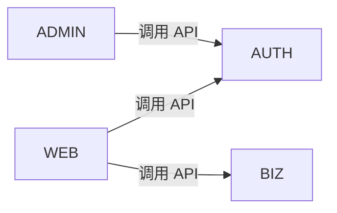

| 依赖方 | 被依赖方 | 依赖类型 | 说明 |
|--------|---------|----------|------|
| WEB | AUTH | API 调用 | 登录/鉴权接口 |

## PL 建议

[PL 对拆分方案的补充说明、风险提示、后续建议等]
```
