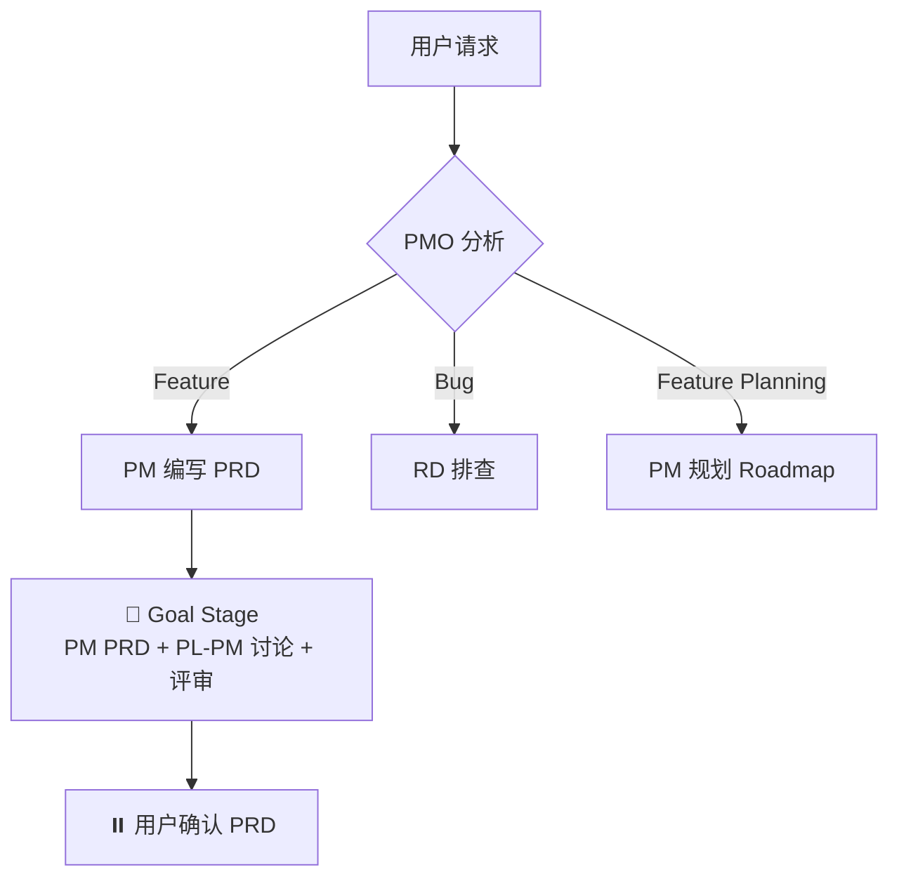

# 通用开发规范

> 前后端共用的规范，所有 RD 必须遵守。
> 📎 后端专项规范见 [backend.md](./backend.md)，前端专项规范见 [frontend.md](./frontend.md)

---

## 一、测试核心原则（前后端通用）

```
❌ 禁止：先写实现代码再补测试
❌ 禁止：跳过测试直接提交代码
✅ 必须：先写测试，再写实现（测试先�）
✅ 必须：测试失败后才写实现代码
✅ 必须：每个 TC 用例都有对应测试
```

### TDD 检查清单（提交前必查）

> 🔴 **单源**：完整 TDD 自检清单 + 反模式 + ≥3 次失败升级规则见 [standards/tdd.md](./tdd.md)。本段仅保留 8 条核心自检快查，详细规则一律以 tdd.md 为准。

```
📋 TDD 自检：
├── [ ] 测试代码先于实现代码编写
├── [ ] 每个 TC 用例都有对应测试
├── [ ] 覆盖率达标（后端 > 80%，前端 > 70%）
├── [ ] 测试可独立运行（无外部依赖）
├── [ ] 测试命名清晰
├── [ ] 包含边界条件测试
├── [ ] 包含异常场景测试
└── [ ] 所有测试通过
```

---

## 二、代码架构规范

### 架构分层原则

```
✅ 必须遵守：
├── 严格遵循项目现有的分层架构（参考 ARCHITECTURE.md）
├── 每一层只做该层该做的事，不越界
├── 依赖方向：上层依赖下层，禁止反向依赖
└── 层与层之间通过接口/协议通信，不直接依赖实现

❌ 禁止：
├── 一个类/文件承担过多职责（God Class）
├── 业务逻辑写在 UI 层
├── 数据访问逻辑散落在各处
├── 工具方法和业务逻辑混在一起
└── 命名模糊不清（如 Helper、Manager、Utils 包含大量不相关方法）
```

### 类/模块职责原则

```
✅ 单一职责：
├── 每个类/模块只负责一件事
├── 类名/文件名能清晰表达其职责
├── 如果一个类做了多件事，必须拆分
├── 方法长度适中，单个方法不超过 50 行
└── 复杂逻辑必须拆分为多个小方法
```

### 代码组织要求

```
📁 文件组织：
├── 相关功能放在同一目录/包下
├── 文件数量适中，单个目录不超过 15 个文件
├── 文件过多时按子功能拆分子目录
└── 公共代码提取到 shared/common 目录

📄 单文件要求：
├── 单个文件不超过 300 行（超过必须拆分）
├── 文件开头有简要说明（这个文件是做什么的）
├── 公开方法/接口放在文件顶部
├── 私有方法放在文件底部
└── 相关方法放在一起，按逻辑分组

📝 命名规范：
├── 类名：名词，表达「是什么」（UserService, PaymentRepository）
├── 方法名：动词，表达「做什么」（createUser, validatePayment）
├── 变量名：有意义，避免 a, b, temp 等无意义命名
└── 常量名：全大写下划线分隔（MAX_RETRY_COUNT）
```

### Review 友好度检查

```
📋 提交代码前自检：
├── [ ] 每个新增的类/文件职责是否单一清晰？
├── [ ] 类名/方法名是否能让 reviewer 一眼理解其作用？
├── [ ] 是否有超过 300 行的文件需要拆分？
├── [ ] 是否有超过 50 行的方法需要拆分？
├── [ ] 复杂逻辑是否有注释说明「为什么这样做」？
├── [ ] 是否遵循了项目现有的分层架构？
└── [ ] 新增代码是否放在了正确的层/目录下？
```

### 架构文档维护规则

> **维护责任人**：资深架构师（在 Dev Stage 的架构师 Code Review 阶段执行）
> **文档位置**：`docs/architecture/ARCHITECTURE.md`

```
❌ 禁止：
├── 跳过架构师 Code Review 就进入 QA 代码审查
├── 新增模块不在架构文档中说明
├── 架构调整不记录设计决策
└── 删除模块不更新架构文档

✅ 必须（架构师 Code Review 时执行）：
├── 审查代码后检查是否需要更新架构文档
├── 新增模块 → 在「核心模块说明」中添加
├── 架构调整 → 更新架构图 + 记录设计决策
├── 目录结构变化 → 更新「目录结构」章节
└── 进入 QA 代码审查前，架构文档必须是最新的
```

---

## 三、测试脚本约定

> RD 在开发阶段负责创建/维护测试脚本。规范只约定脚本接口（名称 + 行为），不约定实现细节（Docker/K8s/本地均可）。
> PMO 和 Test Stage 通过脚本与测试环境交互，不直接执行 docker-compose 等底层命令。

### 两层脚本结构（Monorepo）

```
monorepo/ # 仓库根目录
├── scripts/ # 根级：全局环境（跨子项目共享）
│ ├── test-env-setup.sh # 启动全部依赖服务（DB/Redis/MQ + 各子项目服务）
│ ├── test-env-check.sh # 全局连通性检查
│ └── test-env-teardown.sh # 全局清理（可选）
│
├── packages/
│ ├── api/
│ │ └── scripts/ # 子项目级：只管自己的测试执行
│ │ ├── test-unit.sh # 子项目单元测试
│ │ ├── test-integration.sh # 子项目集成测试（假定全局环境已就绪）
│ │ └── test-api-e2e.sh # 子项目 API E2E
│ ├── web/
│ │ └── scripts/
│ │ ├── test-unit.sh
│ │ └── test-browser-e2e.sh # Browser E2E（可选）
│ └── shared/
│ └── scripts/
│ └── test-unit.sh

分层原则：
├── 根级脚本（scripts/）→ 环境启停，跨子项目共享
│ ├── 启动全部基础设施（DB/Redis/MQ/对象存储 等）
│ ├── 启动各子项目服务（按依赖顺序）
│ └── 加载全局前置数据
├── 子项目脚本（packages/{name}/scripts/）→ 测试执行，只管自己
│ ├── 假定全局环境已就绪，不负责启动环境
│ └── 只运行本子项目的测试
└── PMO 调用顺序：根级 setup → 子项目 test-*
```

### 脚本接口规范

```
🔴 所有脚本必须满足：
├── 退出码：0 = 成功，非 0 = 失败
├── 幂等：重复执行不出错
├── 无交互：不能 read stdin / 弹确认框（自动化脚本场景无 TTY）
└── stdout/stderr：失败时输出足够的诊断信息

【根级脚本】

scripts/test-env-setup.sh（全局环境准备）：
├── 职责：启动全部依赖服务 + 各子项目服务、加载前置数据、等待健康检查
├── 成功时 stdout 最后一行输出 JSON：
│ {"db_url": "...", "redis_url": "...", "services": {"api": "http://localhost:8080", "web": "http://localhost:3000"}}
├── 可选参数：--skip-if-running（已在运行则跳过，加速重复调用）
└── 实现自由：Docker Compose、本地进程、远程环境均可

scripts/test-env-check.sh（全局连通性检查）：
├── 职责：验证全局环境仍然可用（DB/Redis/各服务端口 可达）
├── 轻量快速：只做 ping/连接测试，不启动服务
├── 成功时 stdout 输出检查结果
└── 用途：Test Stage 内部复核（环境检查与实际跑测试之间留容错窗口）

scripts/test-env-teardown.sh（全局清理，可选）：
├── 职责：停止所有服务、清理测试数据
└── 默认保留环境供后续测试复用

【子项目脚本】

{subproject}/scripts/test-unit.sh（子项目单元测试）：
├── 职责：运行本子项目全量单元测试
├── 底层命令由项目决定（cargo test --lib / npm test / pytest 等）
└── 🔴 不依赖全局环境——纯代码级测试

{subproject}/scripts/test-integration.sh（子项目集成测试）：
├── 职责：运行本子项目集成测试（假定全局环境已就绪）
├── 🔴 不负责启动环境——必须先由根级 test-env-setup.sh 完成
└── 输出测试结果 + 覆盖报告到 stdout

{subproject}/scripts/test-api-e2e.sh（子项目 API E2E）：
├── 职责：逐场景验证本子项目 API 链路（假定全局环境已就绪）
├── 参数：可选传入 TC.md 路径以读取 API E2E Scenarios
└── 输出完整 request/response 到 stdout

{subproject}/scripts/test-browser-e2e.sh（Browser E2E，可选）：
├── 职责：浏览器自动化测试
├── 内部处理 playwright/puppeteer 安装检测
└── 输出截图/录屏路径 + 测试结果
```

### RD 创建时机

```
RD 在 TDD 开发阶段创建测试脚本：

根级脚本（首次创建后持续维护，新增子项目依赖时更新）：
├── scripts/test-env-setup.sh ← 首次有集成测试需求时创建
├── scripts/test-env-check.sh ← 与 test-env-setup.sh 同步创建
└── scripts/test-env-teardown.sh ← 可选

子项目脚本（每个子项目按需创建）：
├── test-unit.sh ← 编写单元测试时同步创建
├── test-integration.sh ← 编写集成测试时创建
├── test-api-e2e.sh ← QA 在 TC.md 定义 API E2E 场景后创建
└── test-browser-e2e.sh ← QA 在 TC.md 定义 Browser E2E 场景后创建（如需）

🔴 Dev Stage 自查检查项：测试脚本是否存在且可执行
 RD 自查 → 确认根级 + 子项目脚本存在 + 至少本地跑通一次
 架构师 CR → 确认脚本接口符合约定（退出码/幂等/无交互）
```

### PMO 预检(v8 物化路径)

📎 v7 三级 Subagent dispatch 预检流程(L1/L2/L3)在 v8 已废 · 由以下物化路径替代:
- **Feature ID 冲突** → `state.py prepare-check --feature-id-prefix <PROJ>`(自动返回 next_available_id)
- **测试环境检查** → 各项目自维护 `scripts/test-env-{setup,check}.sh`(本节 §三 接口规范);PMO/RD 按 stage brief 触发
- **stage 入口校验** → `state.py xxx-start` 物化拦截(missing prerequisites + hint)
- **保护标记 / 仓库约束** → 项目根 CLAUDE.md/AGENTS.md(host injection 自动注入)

v8 角色协作走主对话身份切换(不 dispatch Subagent)· 预检由 state.py 命令物化 · 不再依赖 PMO 凭记忆按 L1/L2/L3 顺序跑。

---

## 四、RD 自查规范

> RD 开发完成后、提交 QA 审查前，必须完成自查并输出自查报告。

### 自查触发时机

```
RD 开发完成（测试通过）
 ↓
执行自查清单
 ↓
输出自查报告
 ↓
自查通过 → 进入 QA 代码审查
```

### 自查清单详解

#### 1. 架构合理性检查

```
📋 架构检查项：
├── 分层正确性
│ ├── 是否符合现有分层架构（参考 ARCHITECTURE.md）
│ ├── 业务逻辑是否在正确的层（不在 UI 层/数据层）
│ └── 依赖方向是否正确（上层依赖下层，无反向依赖）
├── 职责清晰性
│ ├── 每个类/模块职责是否单一
│ ├── 是否有 God Class（承担过多职责的类）
│ └── 类名/方法名是否清晰表达其职责
├── 设计合理性
│ ├── 是否有过度设计（不需要的抽象）
│ ├── 是否有设计不足（该抽象没抽象）
│ └── 扩展点是否合理
├── 文档同步
│ ├── 新增/修改的模块是否已更新到 ARCHITECTURE.md
│ └── 决策归属检查：本次开发中产生的设计决策是否放对了位置？
│ ├── 跨 Feature 的架构标准 → architecture/（ARCHITECTURE.md 或子文档的「设计原则」）
│ ├── 单 Feature 的技术选型 → TECH.md
│ └── 📎 判断标准：这个决策在下一个 Feature 中还需要遵守吗？是 → architecture
└── 数据源验证（禁止凭假设编码，必须追溯确认）
 ├── 跨服务字段：读取其他服务的 JSON/protobuf 字段时，追溯到源端确认字段名和值域
 ├── DB Schema：SQL 引用的列必须确认存在于目标表（不同表的列集不同，如 projects 有 deleted_at 但 agents 没有）
 └── 通用原则：A 表/服务有的字段，不代表 B 表/服务也有，必须逐个确认
```

> **💡 BUG-002 教训**：ge-main 读取心跳 JSON 的 `"state"` 字段，但 ge-agent 实际填充的是 `"status"`，`"state"` 始终为空。仅凭字段名语义无法发现此类问题，必须追溯到数据源。
>
> **💡 F055 教训**：SQL 查询 `agents` 表时引用 `deleted_at IS NULL`，但 `agents` 表没有此列（`projects` 有）。不同表的列集不同，不能想当然地套用。

#### 2. 规范遵守检查

```
📋 规范检查项：
├── 日志规范（参考 standards/backend.md「日志规范」）
│ ├── 请求入口/出口有 INFO 日志
│ ├── 异常场景有 ERROR 日志（含 stack）
│ ├── 非预期分支有 WARN 日志
│ ├── 🔴 降级/兜底逻辑（fallback）必须有 WARN 日志（硬规则，无例外）
│ │ ├── 触发：任何「A 失败 → 走 B」的分支（含 Subagent→主对话降级）
│ │ ├── 字段：降级原因 + 原路径 + 兜底路径 + 业务上下文
│ │ └── 缺失即阻塞 CR（静默降级 = 生产事故源头）
│ ├── 🔴 调用三方 / 外部服务返回异常必须有 ERROR 日志（硬规则，无例外）
│ │ ├── 范围：三方 API / 内部其他服务 / 云 SDK / 中间件 / 任何跨进程网络调用
│ │ ├── 触发："返回异常"包含 HTTP 非 2xx、业务错误码、超时、连接失败、反序列化失败、限流熔断等
│ │ ├── 字段：调用目标 + traceId + 请求摘要 + 响应摘要 + 耗时 + 业务上下文
│ │ ├── 与降级并存时：先打 ERROR（异常本身）再打 WARN（降级动作），两条都必须
│ │ └── 缺失即阻塞 CR（APM/sidecar 自动上报不免除业务层打日志义务）
│ ├── 外部服务调用有日志（含耗时，正常调用 INFO，异常调用 ERROR）
│ └── 日志格式符合结构化日志规范
├── API 规范（参考 standards/backend.md「API 接口规范」）
│ ├── 响应格式正确（code/msg/data/extra）
│ ├── JSON key 使用 snake_case
│ └── 错误码定义合理
├── 测试规范（参考 standards/common.md「测试核心原则」）
│ ├── 测试先于实现（检查 git 提交顺序）
│ ├── 覆盖率达标（后端 > 80%，前端 > 70%）
│ └── 测试命名符合 Scenario 描述
└── 代码规范（参考 standards/common.md「代码架构规范」）
 ├── 单文件 < 300 行
 ├── 单方法 < 50 行
 ├── 命名清晰有意义
 └── 复杂逻辑有注释说明「为什么」
```

#### 3. 性能检查

```
📋 性能检查项：
├── 数据库性能
│ ├── 是否有 N+1 查询问题
│ ├── 查询是否使用了合适的索引
│ ├── 大数据量是否有分页/限制
│ └── 是否有不必要的全表扫描
├── 代码性能
│ ├── 是否有不必要的循环或重复计算
│ ├── 是否有可缓存的计算结果未缓存
│ ├── 热点路径是否有缓存考虑
│ └── 是否有潜在的内存泄漏风险
├── 并发安全（数据库写入）
│ ├── 🔴 TOCTOU 检测（先读后写 = 危险信号）：
│ │ ├── 是否存在「先 SELECT 判断，再 UPDATE/INSERT」的模式？
│ │ │ └── 修复：改为原子操作（UPDATE ... WHERE 条件）或 SELECT FOR UPDATE
│ │ ├── 余额/库存/计数器类字段是否用原子操作？
│ │ │ └── 正确：UPDATE SET balance = balance - X WHERE balance >= X
│ │ │ └── 错误：先 SELECT balance → 应用层判断 → UPDATE SET balance = newVal
│ │ └── 唯一性检查是否仅靠应用层？
│ │ └── 必须有数据库唯一约束兜底，应用层检查仅做前置快速失败
│ ├── 乐观锁 / 悲观锁选择：
│ │ ├── 低冲突场景（大部分写入不冲突）→ 乐观锁（version 字段 / updated_at）
│ │ ├── 高冲突场景（秒杀/抢购/频繁并发写同一�）→ 悲观锁（SELECT FOR UPDATE）
│ │ └── 是否有遗漏的并发写入场景未加任何锁保护？
│ ├── 事务粒度：
│ │ ├── 事务内是否包含外部 API 调用或耗时操作？（长事务锁表风险）
│ │ ├── 事务范围是否最小化？（只包含必要的数据库操作）
│ │ └── 嵌套事务是否正确处理？（避免意外提交/回滚）
│ ├── 幂等性：
│ │ ├── 写入接口是否支持重复调用？（网络重试/用户重复提交）
│ │ └── 是否有幂等 key 或去重机制？
│ ├── 竞争条件通用检查：
│ │ ├── 共享资源是否有竞争条件
│ │ ├── 锁的粒度是否合理（过粗 = 性能差，过细 = 复杂度高）
│ │ └── 是否有死锁风险（多表/多资源按固定顺序加锁）
└── 网络性能
 ├── 是否有不必要的网络请求
 ├── 是否可以批量处理减少请求次数
 └── 超时时间是否合理设置
```

#### 4. 安全检查

```
📋 安全检查项：
├── 注入防护
│ ├── SQL 查询是否使用参数化（防 SQL 注入）
│ ├── 命令执行是否有输入校验（防命令注入）
│ └── 模板渲染是否转义（防 XSS）
├── 认证授权
│ ├── 接口是否有权限校验
│ ├── 权限校验是否完整（不能只在前端校验）
│ └── 敏感操作是否有二次确认
├── 数据安全
│ ├── 敏感数据是否脱敏/加密存储
│ ├── 日志中是否泄露敏感信息
│ ├── 错误信息是否暴露系统细节
│ └── 是否有硬编码的密钥/密码
└── 输入校验
 ├── 用户输入是否有长度/格式限制
 ├── 文件上传是否有类型/大小限制
 └── 是否有越权访问风险（如 ID 枚举）
```

### 自查报告模板

```markdown
## RD 自查报告（F{编号}-{功能名}）

### 检查结果汇总
| 维度 | 检查项 | 通过 | 问题 |
|------|--------|------|------|
| 架构合理性 | 4 | 4 | 0 |
| 规范遵守 | 8 | 7 | 1 |
| 性能检查 | 6 | 6 | 0 |
| 安全检查 | 6 | 6 | 0 |
| **合计** | **24** | **23** | **1** |

### 问题详情
| 维度 | 问题 | 严重程度 | 处理方式 |
|------|------|----------|----------|
| 规范遵守 | 用户查询接口缺少 INFO 日志 | 低 | 已修复 |

### 验证证据（🔴 闭环红线，缺少任一项 = 自查未完成）
- 测试命令：`npm test` / `go test ./...` / `pytest`（填实际使用的命令）
- 测试输出：
 ```
 （粘贴实际命令输出，包含通过/失败数量）
 ```
- 测试通过率：X passed, Y failed, Z skipped
- 构建命令：`npm run build` / `go build ./...`（填实际使用的命令）
- 构建结果：✅ 成功 / ❌ 失败（附输出）

🔴 **Build 必须跑通才能进 Code Review**�硬门禁）。CI 是最后一道安全网，不是第一道发现机制。无 build 步骤的项目（纯库 / 纯脚本 / Python 应用）必须显式标注 "无 build 步骤"，不能省略。

🟡 **worktree 场景特别提示**：

- **症状**：单测可跑，`npm run build` / `next build` 失败，提示找不到 webpack / postcss / next 自身等 build 工具链
- **原因**：lazy install 模型下，worktree 内只装了单测需要的 deps，build 工具链 deps 未在 worktree 安装
- **处理选项（按优先级）**：
 ```
 ├── 1. worktree 内补装：npm install --include=dev / pnpm install
 │ 最直接，不引入额外耦合，但耗时 30s-2min
 ├── 2. 软链 node_modules：ln -s {主 worktree}/node_modules ./node_modules
 │ 最快（秒级），但 monorepo workspace / 不同 lockfile 时易出怪问题
 └── 3. 写到项目 KNOWLEDGE.md（Gotcha 类）
 如果 build deps 长期需要全装齐，把"worktree 必须 npm install --include=dev"
 记入 KNOWLEDGE.md，让后续 Feature PMO 在 Goal Stage preflight 时知道
 ```

### 自查结论
✅ 自查通过（含验证证据，含 build 通过），可进入架构师 Code Review
```

### 自查结果处理

```
自查结果：
├── 全部通过 → ✅ 进入 QA 代码审查
├── 有低风险问题
│ ├── 可快速修复 → 修复后重新自查
│ └── 有正当理由 → 记录到报告，继续
└── 有高风险问题
 └── 必须修复 → 修复后重新自查
```

---

## 四B、Designer 自查规范

> Designer 完成 UI 设计后、用户确认设计稿前，必须完成自查并输出自查报告写入 UI.md。
>
> 物化拦截：[tools/verify-panorama.py](../tools/verify-panorama.py) 校验自查报告完整性 + sitemap.md mtime + preview/ 数量 · UI Design Stage 出口前置。

### 自查触发时机

```
Designer 完成设计（UI.md + preview/*.html 草稿）
 ↓
执行自查清单（5 维度 · 见下）
 ↓
输出 Designer 自查报告（写入 UI.md 末尾）
 ↓
verify-panorama.py 物化校验 → 全 ✅ 才进 ⏸️ 用户确认设计稿
```

### 自查清单详解（5 维度）

#### 1. 全景对齐

```
📋 全景对齐检查项：
├── panorama_path 已 read（cite Stage 入口实例化 Step 0 探测结果）
├── Feature UI 风格 / 配色 / 布局 / 语言与全景一致（read panorama_path/sitemap.md + overview.html 对照）
├── Feature 页面在全景中的位置已确认（新增节点 / 修改既有节点 / 影响哪条导航）
└── 跨子项目场景（panorama_path 不在当前 Feature 子项目）
 ├── UI.md 顶部已标注「全景宿主：{hosting_subproject}」
 └── 已显式说明「为什么走跨子项目全景」（防 Designer 凭印象）
```

🔴 项目无全景路径（Step 0 决策为 panorama_path=null）→ 标注「⚠️ 项目无全景基准 · 本 Feature UI 设计为独立基准」+ Concerns 记录。

#### 2. 状态覆盖

```
📋 状态覆盖检查项：
├── 每页面有正常态 HTML preview
├── 每页面有空态 HTML preview
├── 每页面有加载态 HTML preview
└── 每页面有错误态 HTML preview
```

🔴 缺态即阻塞 · ❌ 反模式：用文字描述代替 HTML preview。

#### 3. PRD AC 覆盖

```
📋 AC 覆盖检查项：
├── 每条 PRD AC 在 UI.md 找到对应页面 / 组件支撑
├── 输出 UI-AC-COVERAGE 表（AC.id → 页面/组件 → 覆盖状态）
└── 非 UI 类 AC（纯后端 / 纯逻辑）显式标注「⚠️ 需 RD 实现 · 非 UI」
```

#### 4. 全景增量同步（涉及变更时）

```
📋 全景增量同步检查项：
├── 判断本 Feature 是否引入新页面 / 修改现有页面结构 / 变更导航关系？
│ ├── 是 → 执行增量合并（下方 4 项）
│ └── 否 → 显式输出「⏭️ 本 Feature 无页面结构变更 · 全景无需同步」 + 跳过下方
├── design/sitemap.md 已 modify-in-place（不重写 / 不删除 / append 新页面）
├── design/preview/overview.html 已 modify-in-place
├── sitemap.md 对应段加标红注释 `<!-- 🟡 {日期}: {FeatureID} 本次变更：{变更摘要} -->`
└── 自查报告含全景结构 diff（前后页面清单 / overview.html DOM 差异摘要）
```

#### 5. 结构性变更红线（兜底拦截）

```
📋 结构性变更检查项：
├── 本 Feature 不涉及「删除现有页面」
├── 本 Feature 不涉及「重构导航结构」
└── 本 Feature 不涉及「修改核心业务流程状态机」
```

🔴 任一命中 → **停止本 Stage** → 返回 DONE_WITH_CONCERNS · 建议用户走 Feature Planning 而非 Feature 流程。

### Designer 自查报告模板

UI.md 末尾必含本段（verify-panorama.py grep 校验）：

```markdown
## Designer 自查报告（🔴 出口必填 · verify-panorama.py 校验）

### 检查结果汇总
| 维度 | 检查项 | 通过 | 备注 |
|------|------|----|----|
| 1. 全景对齐 | 4 | ?/4 | panorama_path = ... · 宿主 = {当前/跨子项目→XX} |
| 2. 状态覆盖 | 4×N页 | ?/? | N 个页面 · 每页 4 态 |
| 3. PRD AC 覆盖 | M | ?/M | M 条 AC · 详 UI-AC-COVERAGE 表 |
| 4. 全景增量同步 | 4 | ?/4 | 类型：⏭️ 无变更 / 🟡 增量 / 🔴 结构性 |
| 5. 结构性变更红线 | 3 | ?/3 | 任一命中即停 Stage |

### 全景对齐证据
- panorama_path: {绝对路径}
- 全景宿主：{当前子项目 / 跨子项目→{hosting_subproject}}
- 风格对照：{摘录 panorama/sitemap.md 已有规范 + 本 Feature 遵守说明 ≥3 条}
- 导航位置：{本 Feature 页面在 sitemap 中的层级路径}
- 全景变更类型：⏭️ 无 / 🟡 增量（diff 见下）/ 🔴 结构性（不应继续）

### 全景增量 diff（仅 🟡 增量类型必填）
```diff
sitemap.md 变更：
+ 新增页面 X（位置：根 → A → X）
~ 修改页面 Y（导航文案变更：旧→新）
- （禁止删除条目）

overview.html DOM 变更：
+ 新增 <section data-page="X"> 节点（位置：第 N 个 section 之后）
~ 修改 <nav> 中页面 Y 的链接文案
```

### 自查结论
✅ 自查通过 · 可进入 ⏸️ 用户确认设计稿
⚠️ N 项未通过 · 已修复 · 重跑自查
🔴 结构性变更触发停 Stage · 建议走 Feature Planning
```

### 自查结果处理

```
自查结果：
├── 全 ✅ → ⏸️ 用户确认设计稿
├── 有 ⚠️ 低风险（如 1 个 AC 未覆盖且已补）→ 修复后重新自查
├── 🔴 结构性变更红线命中 → 停 Stage → DONE_WITH_CONCERNS
└── verify-panorama.py 校验 FAIL → 按 stderr hint 补完自查报告 → 重跑
```

---

## 四C、权威源单源规则（跨角色汇总指针）

> **本节定位**：跨角色 meta-rule · 不复述各 role L2 sub-spec 原文 · 只列表汇总 + 后续注册模板.

**核心原则**：每个产物维度有唯一**权威源**（spec / template / panorama / KNOWLEDGE 等）· peer Feature 仅可作**内容参考**（写法、套路、决策历史）· ❌ 禁止当**格式 / 框架 / schema** 基线.

**优先级**：teamwork 规范权威源 > peer Feature 历史. 触发"参考最近相似 Feature"心智路径时 · 默认走错 · 必须改走权威源.

**已注册维度**（各 L2 sub-spec 仍是原文 · 本表只指针）：

| 角色 | 维度 | 权威源 | L2 sub-spec | 实证 case |
|-----|------|-------|------------|----------|
| PMO | 格式 / frontmatter / schema | `templates/` | [pmo.md § 格式权威守门](../roles/pmo.md) | |
| Designer | 框架 / 配色 / layout / region | panorama `preview/overview.html` | [designer.md § 6 维自查](../roles/designer.md) · [ui-design-stage.md § 框架基线唯一性](../stages/ui-design-stage.md) | (PTR-F032) |

**新维度注册要求**（Architect / RD / QA 实战触发时按此模板加行 · 不再重复论证 meta）：
1. cite 实证 case · 写明 AI 走的捷径心智路径
2. 反模式黑名单 ≥3 条（具体措辞 / 心智路径 / 顺序倒置）
3. 下游校验工具或 grep 锚点（出口拦截 · R-SP-8 reader 兜底）
4. 在本表加一行 · 各 role L2 sub-spec 落详规则

---

## 四D、QA 代码审查检查项

> 🔴 QA 代码审查的核心是**读代码验证 TC**，TDD 规范检查是辅助手段。

### TC 逐条验证（🔴 必须，核心检查项）

```
📋 TC 验证报告：
| TC 编号 | 场景描述 | 实现覆盖 | 测试覆盖 | 代码位置 | 说明 |
|---------|----------|----------|----------|----------|------|
| TC-001 | xxx | ✅/❌ | ✅/❌ | src/xxx | [验证方式] |

🔴 检查要点：
├── 实现覆盖：阅读实现代码，确认逻辑是否处理了 TC 描述的场景
├── 测试覆盖：阅读测试代码，确认测试是否验证了 TC 的预期行为
├── 🔴 不能只看测试通过率，要看测试断言是否验证了正确的东西
└── 🔴 不能因为 Blueprint Stage 架构师评审通过就跳过代码阅读

TC 验证率: X/Y (XX%)
├── 实现覆盖率: X/Y
└── 测试覆盖率: X/Y
```

### TDD 规范检查

> 🔴 **单源**：完整 TDD 规范 + 反模式见 [standards/tdd.md](./tdd.md) §三 + §四。本段仅保留 QA Code Review 时的 5 条快查。

```
📋 TDD 规范检查：
├── 测试先于实现: ✅/❌ (检查 git 提交顺序)
├── 测试覆盖率: XX% (后端 > 80%，前端 > 70%)
├── 测试可独立运行: ✅/❌
├── 测试命名规范: ✅/❌
└── 边界条件覆盖: ✅/❌
```

### 架构文档检查

```
📋 架构文档检查：
├── 架构文档是否存在: ✅/❌
├── 架构文档是否最新: ✅/❌ (检查「最后更新」日期)
├── 新增模块是否已记录: ✅/❌
├── 目录结构是否准确: ✅/❌
└── 分层职责是否清晰: ✅/❌
```

### 设计-代码一致性（有 UI 交互 且 UI.md 存在时必查）

```
📋 设计-代码一致性检查：
├── 对照对象：docs/features/{Feature}/UI.md（UI Design Stage DONE 版本）
├── 检查维度：
│ ├── UI 元素齐全：按钮 / 弹窗 / 输入 / 列表项 / 导航
│ ├── 交互流程一致：点击响应 / 跳转 / 表单提交 / 反馈
│ ├── 边界状态实现：空态 / 错误态 / Loading / 禁用态
│ └── 关键文案一致（允许微调，需标注）
├── 粒度：🟡 结构 + 交互层面，不做像素级比对（像素回归归 Browser E2E）
├── 偏差分级：
│ ├── 🔴 主流程缺失/关键交互走样 → QUALITY_ISSUE（打回 Dev）
│ ├── 🟡 非主流程偏差 → concerns（不阻塞）
│ └── 🟢 文案/视觉微调 → 仅记录
├── UI.md 本身问题（不可实现/自相矛盾）→ ⏸️ Designer 确认
└── 无 UI.md 或纯后端功能：跳过并在报告标 ⏭️
```

### 实现完整性检查

```
📋 实现完整性：
| 需求项 | 状态 | 代码位置 |
|--------|------|----------|
| xxx | ✅ | src/xxx |

完整性: X/Y (XX%)
```

---

## 四点五、调试日志规范Ｔ mattpocock/skills diagnose）

🔴 **`[DEBUG-{Feature}-{NNNN}]` 唯一前缀规则**：临时调试日志（println / console.log / log.debug 等）必须用统一前缀 `[DEBUG-{Feature}-{NNNN}]`，方便 ship 前一次性 grep 清理。

```
✅ 正确：
console.log("[DEBUG-F062-0001] payload before validation:", payload);
log.debug("[DEBUG-F062-0002] cache hit ratio:", ratio);

❌ 错误：
console.log("xxx", payload); // 无前缀 · ship 前难定位
console.log("debug:", payload); // 通用 debug 字面值 · 与既有日志冲突
```

🔴 **Ship 前清理硬规则**：Ship Stage Step 1 净化阶段必须 grep `\[DEBUG-` 确认零匹配；命中即报 ship.sanitize_log.suspicious_files 让用户决定（保留生产 / 删除 / 改正式 SLogger）。

🟢 **设计动机**：`[DEBUG-` 前缀比裸 `console.log` 易识别 + 不与正式 logger（SLogger / Log / logger）冲突 + 一次 grep 全清。Feature ID + 序号便于多 Feature 并行调试时区分来源。

---

## 五、文档流程图规范

### 统一使用 Mermaid

```
🔴 强制规则：
├── 所有文档中的流程图、时序图、架构图统一使用 Mermaid 语法
├── 禁止使用纯文本 ASCII 流程图、图片截图、第三方绘图工具链接
├── Mermaid 代码块必须使用 ```mermaid 标记
└── 图表必须可在 GitHub / Markdown 预览器中直接渲染
```

### 箭头方向约定

```
🔴 强制规则：依赖关系图中，箭头统一指向被依赖方（A --> B 表示 A 依赖 B）。

├── 子项目依赖图：WEB --> AUTH 表示 WEB 依赖 AUTH
├── 模块依赖图：Controller --> Service 表示 Controller 依赖 Service
├── ER 关系图：遵循 Mermaid erDiagram 语法（关系符号表达基数）
├── 数据流/调用链：箭头表示调用方向（A --> B 表示 A 调用 B），与依赖方向一致
└── 流程图：箭头表示流程推进方向（不是依赖，不受此规则约束）

⚠️ 禁止混用：同一张图中不能既用箭头表示「依赖」又用箭头表示「被依赖」。
```

### 适用场景与图表类型

```
├── 业务流程 → flowchart TD / LR
├── 时序交互 → sequenceDiagram
├── 状态流转 → stateDiagram-v2
├── 架构分层 → graph TD
├── 类关系 → classDiagram
└── ER 关系 → erDiagram
```

### 示例


