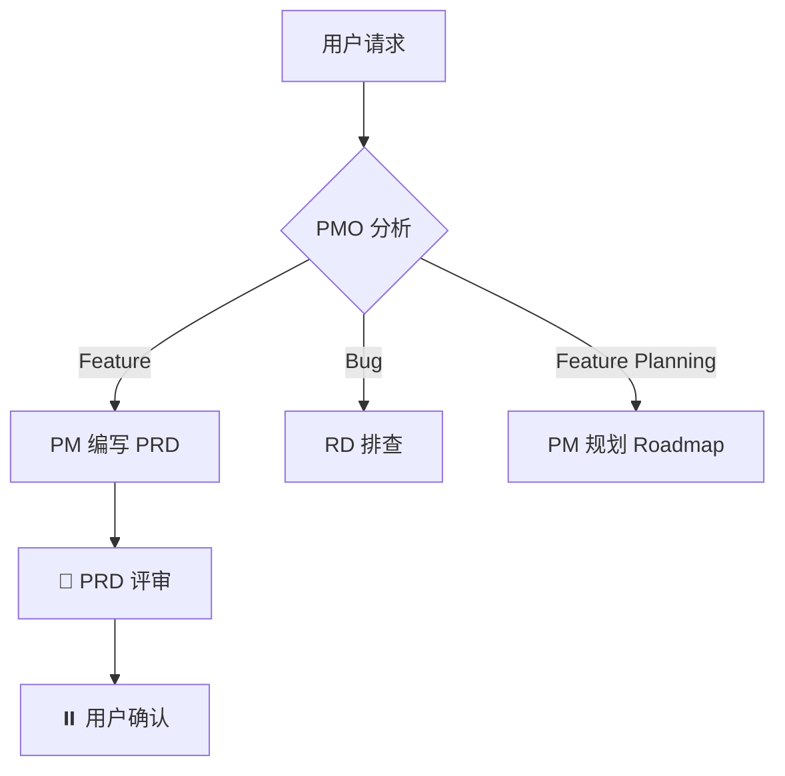

# 通用开发规范

> 前后端共用的规范，所有 RD 必须遵守。
> 📎 后端专项规范见 [backend.md](./backend.md)，前端专项规范见 [frontend.md](./frontend.md)

---

## 一、测试核心原则（前后端通用）

```
❌ 禁止：先写实现代码再补测试
❌ 禁止：跳过测试直接提交代码
✅ 必须：先写测试，再写实现（测试先行）
✅ 必须：测试失败后才写实现代码
✅ 必须：每个 TC 用例都有对应测试
```

### TDD 检查清单（提交前必查）

```
📋 TDD 自检：
├── [ ] 测试代码先于实现代码编写
├── [ ] 每个 TC 用例都有对应测试
├── [ ] 覆盖率达标（后端 > 80%，前端 > 70%）
├── [ ] 测试可独立运行（无外部依赖）
├── [ ] 测试命名清晰
├── [ ] 包含边界条件测试
├── [ ] 包含异常场景测试
└── [ ] 所有测试通过
```

---

## 二、代码架构规范

### 架构分层原则

```
✅ 必须遵守：
├── 严格遵循项目现有的分层架构（参考 ARCHITECTURE.md）
├── 每一层只做该层该做的事，不越界
├── 依赖方向：上层依赖下层，禁止反向依赖
└── 层与层之间通过接口/协议通信，不直接依赖实现

❌ 禁止：
├── 一个类/文件承担过多职责（God Class）
├── 业务逻辑写在 UI 层
├── 数据访问逻辑散落在各处
├── 工具方法和业务逻辑混在一起
└── 命名模糊不清（如 Helper、Manager、Utils 包含大量不相关方法）
```

### 类/模块职责原则

```
✅ 单一职责：
├── 每个类/模块只负责一件事
├── 类名/文件名能清晰表达其职责
├── 如果一个类做了多件事，必须拆分
├── 方法长度适中，单个方法不超过 50 行
└── 复杂逻辑必须拆分为多个小方法
```

### 代码组织要求

```
📁 文件组织：
├── 相关功能放在同一目录/包下
├── 文件数量适中，单个目录不超过 15 个文件
├── 文件过多时按子功能拆分子目录
└── 公共代码提取到 shared/common 目录

📄 单文件要求：
├── 单个文件不超过 300 行（超过必须拆分）
├── 文件开头有简要说明（这个文件是做什么的）
├── 公开方法/接口放在文件顶部
├── 私有方法放在文件底部
└── 相关方法放在一起，按逻辑分组

📝 命名规范：
├── 类名：名词，表达「是什么」（UserService, PaymentRepository）
├── 方法名：动词，表达「做什么」（createUser, validatePayment）
├── 变量名：有意义，避免 a, b, temp 等无意义命名
└── 常量名：全大写下划线分隔（MAX_RETRY_COUNT）
```

### Review 友好度检查

```
📋 提交代码前自检：
├── [ ] 每个新增的类/文件职责是否单一清晰？
├── [ ] 类名/方法名是否能让 reviewer 一眼理解其作用？
├── [ ] 是否有超过 300 行的文件需要拆分？
├── [ ] 是否有超过 50 行的方法需要拆分？
├── [ ] 复杂逻辑是否有注释说明「为什么这样做」？
├── [ ] 是否遵循了项目现有的分层架构？
└── [ ] 新增代码是否放在了正确的层/目录下？
```

### 架构文档维护规则

> **维护责任人**：资深架构师（在架构师 Code Review Subagent 中执行）
> **文档位置**：`docs/architecture/{项目}/ARCHITECTURE.md`

```
❌ 禁止：
├── 跳过架构师 Code Review 就进入 QA 代码审查
├── 新增模块不在架构文档中说明
├── 架构调整不记录设计决策
└── 删除模块不更新架构文档

✅ 必须（架构师 Code Review 时执行）：
├── 审查代码后检查是否需要更新架构文档
├── 新增模块 → 在「核心模块说明」中添加
├── 架构调整 → 更新架构图 + 记录设计决策
├── 目录结构变化 → 更新「目录结构」章节
└── 进入 QA 代码审查前，架构文档必须是最新的
```

---

## 三、RD 自查规范

> RD 开发完成后、提交 QA 审查前，必须完成自查并输出自查报告。

### 自查触发时机

```
RD 开发完成（测试通过）
    ↓
执行自查清单
    ↓
输出自查报告
    ↓
自查通过 → 进入 QA 代码审查
```

### 自查清单详解

#### 1. 架构合理性检查

```
📋 架构检查项：
├── 分层正确性
│   ├── 是否符合现有分层架构（参考 ARCHITECTURE.md）
│   ├── 业务逻辑是否在正确的层（不在 UI 层/数据层）
│   └── 依赖方向是否正确（上层依赖下层，无反向依赖）
├── 职责清晰性
│   ├── 每个类/模块职责是否单一
│   ├── 是否有 God Class（承担过多职责的类）
│   └── 类名/方法名是否清晰表达其职责
├── 设计合理性
│   ├── 是否有过度设计（不需要的抽象）
│   ├── 是否有设计不足（该抽象没抽象）
│   └── 扩展点是否合理
└── 文档同步
    └── 新增/修改的模块是否已更新到 ARCHITECTURE.md
```

#### 2. 规范遵守检查

```
📋 规范检查项：
├── 日志规范（参考 standards/backend.md「日志规范」）
│   ├── 请求入口/出口有 INFO 日志
│   ├── 异常场景有 ERROR 日志（含 stack）
│   ├── 非预期分支有 WARN 日志
│   ├── 外部服务调用有日志（含耗时）
│   └── 日志格式符合结构化日志规范
├── API 规范（参考 standards/backend.md「API 接口规范」）
│   ├── 响应格式正确（code/msg/data/extra）
│   ├── JSON key 使用 snake_case
│   └── 错误码定义合理
├── 测试规范（参考 standards/common.md「测试核心原则」）
│   ├── 测试先于实现（检查 git 提交顺序）
│   ├── 覆盖率达标（后端 > 80%，前端 > 70%）
│   └── 测试命名符合 Scenario 描述
└── 代码规范（参考 standards/common.md「代码架构规范」）
    ├── 单文件 < 300 行
    ├── 单方法 < 50 行
    ├── 命名清晰有意义
    └── 复杂逻辑有注释说明「为什么」
```

#### 3. 性能检查

```
📋 性能检查项：
├── 数据库性能
│   ├── 是否有 N+1 查询问题
│   ├── 查询是否使用了合适的索引
│   ├── 大数据量是否有分页/限制
│   └── 是否有不必要的全表扫描
├── 代码性能
│   ├── 是否有不必要的循环或重复计算
│   ├── 是否有可缓存的计算结果未缓存
│   ├── 热点路径是否有缓存考虑
│   └── 是否有潜在的内存泄漏风险
├── 并发性能
│   ├── 共享资源是否有竞争条件
│   ├── 锁的粒度是否合理
│   └── 是否有死锁风险
└── 网络性能
    ├── 是否有不必要的网络请求
    ├── 是否可以批量处理减少请求次数
    └── 超时时间是否合理设置
```

#### 4. 安全检查

```
📋 安全检查项：
├── 注入防护
│   ├── SQL 查询是否使用参数化（防 SQL 注入）
│   ├── 命令执行是否有输入校验（防命令注入）
│   └── 模板渲染是否转义（防 XSS）
├── 认证授权
│   ├── 接口是否有权限校验
│   ├── 权限校验是否完整（不能只在前端校验）
│   └── 敏感操作是否有二次确认
├── 数据安全
│   ├── 敏感数据是否脱敏/加密存储
│   ├── 日志中是否泄露敏感信息
│   ├── 错误信息是否暴露系统细节
│   └── 是否有硬编码的密钥/密码
└── 输入校验
    ├── 用户输入是否有长度/格式限制
    ├── 文件上传是否有类型/大小限制
    └── 是否有越权访问风险（如 ID 枚举）
```

### 自查报告模板

```markdown
## RD 自查报告（F{编号}-{功能名}）

### 检查结果汇总
| 维度 | 检查项 | 通过 | 问题 |
|------|--------|------|------|
| 架构合理性 | 4 | 4 | 0 |
| 规范遵守 | 8 | 7 | 1 |
| 性能检查 | 6 | 6 | 0 |
| 安全检查 | 6 | 6 | 0 |
| **合计** | **24** | **23** | **1** |

### 问题详情
| 维度 | 问题 | 严重程度 | 处理方式 |
|------|------|----------|----------|
| 规范遵守 | 用户查询接口缺少 INFO 日志 | 低 | 已修复 |

### 自查结论
✅ 自查通过，可进入 QA 代码审查
```

### 自查结果处理

```
自查结果：
├── 全部通过 → ✅ 进入 QA 代码审查
├── 有低风险问题
│   ├── 可快速修复 → 修复后重新自查
│   └── 有正当理由 → 记录到报告，继续
└── 有高风险问题
    └── 必须修复 → 修复后重新自查
```

---

## 四、QA 代码审查检查项

### TDD 规范检查

```
📋 TDD 规范检查：
├── 测试先于实现: ✅/❌ (检查 git 提交顺序)
├── 测试覆盖率: XX% (后端 > 80%，前端 > 70%)
├── 测试可独立运行: ✅/❌
├── 测试命名规范: ✅/❌
└── 边界条件覆盖: ✅/❌
```

### 架构文档检查

```
📋 架构文档检查：
├── 架构文档是否存在: ✅/❌
├── 架构文档是否最新: ✅/❌ (检查「最后更新」日期)
├── 新增模块是否已记录: ✅/❌
├── 目录结构是否准确: ✅/❌
└── 分层职责是否清晰: ✅/❌
```

### 实现完整性检查

```
📋 实现完整性：
| 需求项 | 状态 | 代码位置 |
|--------|------|----------|
| xxx    | ✅   | src/xxx  |

完整性: X/Y (XX%)
```

---

## 五、文档流程图规范

### 统一使用 Mermaid

```
🔴 强制规则：
├── 所有文档中的流程图、时序图、架构图统一使用 Mermaid 语法
├── 禁止使用纯文本 ASCII 流程图、图片截图、第三方绘图工具链接
├── Mermaid 代码块必须使用 ```mermaid 标记
└── 图表必须可在 GitHub / Markdown 预览器中直接渲染
```

### 适用场景与图表类型

```
├── 业务流程 → flowchart TD / LR
├── 时序交互 → sequenceDiagram
├── 状态流转 → stateDiagram-v2
├── 架构分层 → graph TD
├── 类关系   → classDiagram
└── ER 关系  → erDiagram
```

### 示例


