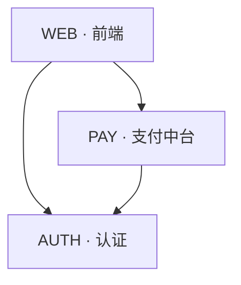

# {项目名} · Workspace 架构

> **workspace 级系统架构**(实例化:`project-specs/ARCHITECTURE.md`)—— 子项目拓扑 + 依赖 + 目录布局。
> 🔴 **区别于** per-subproject `{子项目}/docs/architecture/`(单子项目**内部**技术架构:技术栈/分层/模块)· 本文件只画**跨子项目**关系。
> 🔵 本文件是 `teamwork-space.md`「知识入口 · 系统架构」节指向的节点 · 偶尔读(跨子项目设计时)· 子项目清单(谁存在 / docs_root)仍在 teamwork-space.md。
> 维护:PL 子项目拆分方案产出 → PMO 填入 · 结构变更时 PM 更新(详 [teamwork-space-guide.md §4](../docs/teamwork-space-guide.md))。

## 一、子项目拓扑

<!-- 子项目间的调用 / 数据流关系 · 不画子项目内部 -->



## 二、依赖关系

<!-- midplatform 的消费方 · 关键跨子项目契约 · ≤1 行/项 -->

| 子项目 | 依赖 | 被谁消费(midplatform) | 关键契约 |
|--------|------|----------------------|----------|
| AUTH | - | WEB, PAY | Token 签发 / 校验 |
| PAY | AUTH | WEB | 渠道/状态/对账 |

## 三、Workspace 目录布局

<!-- 🔴 只展开子项目**内部**物理结构 · **顶层知识节点**(product-overview/project-specs/external/归档)不在此重复 —— 它们在 teamwork-space.md「知识入口」· 此处只补"代码在哪" -->

```
项目根/
├── {子项目A}/                  # business — 负责:{职责}。不负责:{边界}
│   ├── docs/                  # PROJECT / ARCHITECTURE / ROADMAP / KNOWLEDGE / sitemap / features/
│   └── src/                   # {内部分层简述}
└── {子项目B}/
    ├── docs/
    └── src/
```

> 顶层知识节点(`product-overview/` · `project-specs/` · `external/` · `docs/features/_archive/`)→ 见 `teamwork-space.md`「知识入口」(不在此重复)。
