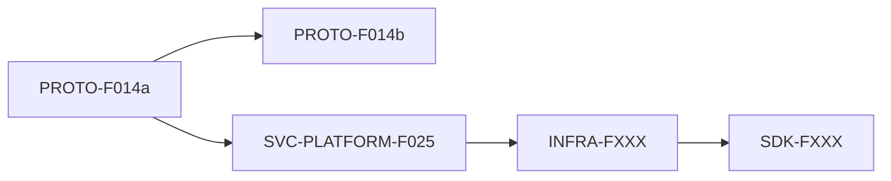

# Change Request 模板（v7.3.10+P0-33 新增）

> **位置**：`product-overview/changes/{change_id}.md`
> **触发**：业务方向调整 / 技术债清理 / 架构演进 / 大 Bug 升级 / 跨子项目影响事件
> **产出者**：PL（讨论模式锁定方向）+ PM/RD/Architect（详细规划）+ PMO（流程编排）
> **核心原则**：**变更内所有子 Feature 完整规划完成才能锁定（status=locked）；锁定后才能启动具体 Feature**——避免"边规划边启动"反模式

---

## 状态生命周期

```
discussion ──→ planning ──→ locked ──→ in-progress ──→ completed
                  ↓                       ↓
              abandoned              abandoned
```

| 状态 | 含义 | 允许的操作 |
|------|------|----------|
| `discussion` | PL 讨论方向中 | 修改 background / affected_subprojects |
| `planning` | PM/RD/Architect 详细规划中 | 修改 sub_features / dependencies / launch_order |
| `locked` | 规划完成，所有子 Feature 编号 + 范围 + 依赖锁定 | **启动子 Feature**（按 launch_order） |
| `in-progress` | ≥1 个子 Feature 已启动 | 启动后续子 Feature / 更新子 Feature 状态 |
| `completed` | 所有子 Feature 状态 = completed | 只读，作历史归档 |
| `abandoned` | 用户决定放弃本变更 | 只读，作历史归档 |

🔴 **核心约束（v7.3.10+P0-33 新增）**：`status != locked` 时**禁止启动**任何归属本变更的子 Feature；PMO 在 triage 时硬阻塞，仅允许"用户明确说强制启动"逃生舱。

---

## 模板

```markdown
---
change_id: CR-001
title: <一句话标题>
status: discussion | planning | locked | in-progress | completed | abandoned
trigger: business-direction | tech-debt | architecture-evolution | bug-escalation | other
created_at: <ISO 8601 UTC>
locked_at: null  # status 转 locked 时填
in_progress_at: null  # 第一个子 Feature 启动时填
completed_at: null  # 所有子 Feature 完成时填

affected_subprojects:
  - PROTO
  - SVC-PLATFORM
  - INFRA
  - SDK

sub_features:
  - id: PROTO-F014a
    scope: "..."
    flow_type: feature  # feature | agile | bug | micro
    estimated_hours: 4-6
    dependencies: []  # 该子 Feature 依赖的其他子 Feature ID 列表
    status: pending | in-progress | completed | abandoned
    started_at: null
    completed_at: null
  - id: PROTO-F014b
    scope: "..."
    flow_type: feature
    estimated_hours: 4-6
    dependencies: [PROTO-F014a]
    status: pending
  # ... 其他子 Feature

launch_order:
  # 按依赖拓扑排序的启动顺序，PMO 在 triage 时校验当前 Feature 是否在下一个可启动节点
  - PROTO-F014a
  - PROTO-F014b
  - SVC-PLATFORM-F025
  - INFRA-FXXX  # 锁定时分配具体编号
  - SDK-FXXX

related_adrs:
  # 本变更涉及的关键技术决策（落 ADR 的）
  - {Feature}/adrs/ADR-003-rust-rename-strategy.md

risks:
  - id: R1
    description: "..."
    mitigation: "..."
    severity: high | medium | low
---

# {change_id}：{title}

## 背景

{变更触发原因 / 业务或技术驱动 / 上下文}

## 影响范围

{哪些子项目 / 影响层级（L1 功能级 / L2 业务模块级 / L3 方向级）/ 是否影响生产环境}

## 子 Feature 详情

### {sub_feature_id}（如 PROTO-F014a）

- **范围**：{具体做什么}
- **流程类型**：{feature / agile / bug / micro}
- **估时**：{X-Y 小时}
- **依赖**：{依赖的其他子 Feature ID}
- **验收标准**（高层级，详细 AC 在子 Feature PRD 中）：
  - ...

### ...

## 依赖关系



## 风险与缓解

| ID | 描述 | 严重度 | 缓解措施 |
|----|------|--------|---------|
| R1 | ... | high | ... |

## 启动顺序与里程碑

按 `launch_order` 顺序启动子 Feature：

1. **{sub_feature_id_1}**（{描述}）→ 完成后解锁 {后续}
2. **{sub_feature_id_2}**（{描述}）→ 完成后解锁 {后续}
3. ...

里程碑：
- {milestone_1}：完成 {sub_feature_ids}（预计 {时间}）
- {milestone_2}：...

## 锁定决策记录

锁定时间：{ISO 8601 UTC}
锁定者：{user / PMO confirmed by user}
锁定理由：{为什么此时锁定 / 用户接受规划的关键决策}

## 变更日志

| 时间 | 变更 | 操作者 |
|------|------|-------|
| {ISO} | 创建（status=discussion）| PL |
| {ISO} | 进入 planning（PL 讨论结论）| PL |
| {ISO} | 子 Feature 拆分完成（5 子 Feature）| PM |
| {ISO} | 锁定（status=locked）| user |
| {ISO} | 第一个子 Feature 启动（PROTO-F014a）| PMO |
| ... | ... | ... |
```

---

## 与 teamwork_space.md 的关系（v7.3.10+P0-59 单源化）

`teamwork_space.md` **完全不维护变更类信息**——本文件 `product-overview/changes/{change_id}.md` 是变更的唯一权威源（status / 简介 / 影响子项目 / 子 Feature / 推进顺序 / 联调依赖 / 锁定决策 / 变更日志全部在本文件 frontmatter + 正文里）。

跨变更回溯查询：`ls product-overview/changes/*.md` / `grep -l "status: locked" product-overview/changes/*.md`。

Feature → 变更反查：Feature `state.json` 通过 `change_id` 字段反向引用本文件。

---

## 与 ADR 的关系

- **变更（Change Request）**：跨多 Feature 的协作规划（"做什么 / 什么顺序"）
- **ADR**：单一技术决策（"为什么选 X 不选 Y"）

两者并存、互相引用：
- 变更内某个技术选型需要决策记录 → 落 ADR，在变更文档 `related_adrs` 字段引用
- ADR 涉及多 Feature 协作 → 在 ADR Consequences 段引用变更文档

---

## 与 ROADMAP.md 的关系

- **ROADMAP.md**（项目级）：长期规划，多变更预想，按主题归类
- **change-request**（变更级）：单个变更的精细化规划，按时间触发

变更内子 Feature 锁定后 → 各子项目 ROADMAP.md 一次性登记（按 `launch_order` 顺序），但不复制变更详情；只列子 Feature 编号 + 简介 + 链接到变更文档。

---

## 编号约定

| 前缀 | 含义 | 适用场景 |
|------|------|---------|
| `CR-` | Change Request（推荐） | 通用业内标准 |
| `BG-` | Business Goal（兼容已有命名） | 业务目标驱动的变更 |
| `TD-` | Tech Debt（可选） | 技术债清理类 |

🔴 同一项目内编号唯一（`CR-001` 与 `BG-001` 不同时存在）；编号顺序由 PL 在 discussion 阶段分配，锁定后不变。

---

## v7.3.10+P0-33 设计要点

1. **变更详情独立文档** → `product-overview/changes/{change_id}.md`，避免 teamwork_space.md 膨胀
2. **frontmatter 机读** → PMO 在 triage 时可程序化查询变更状态 + 子 Feature 列表 + 依赖
3. **状态机硬约束** → status=locked 才能启动子 Feature；PMO 硬阻塞 + 用户明确说强制启动逃生舱
4. **launch_order 拓扑排序** → 启动顺序明确，避免乱启
5. **变更日志可追溯** → 每次状态变更 + 子 Feature 状态变更都记录
